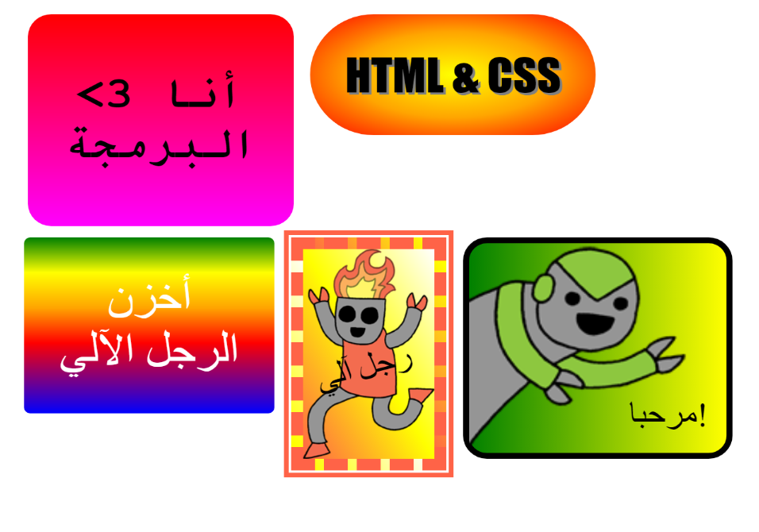

## المقدمة

في هذا المشروع، ستنشئ الكثير من الملصقات الطريقة التي يمكنك استخدامها لتزيين صفحات الويب. وستتعلم كيفية استخدام التدرجات التي تتغير من لون إلى آخر تدريجيًا لتظهر ملصقاتك بشكل رائع. 

### معلومات إضافية لقادة النادي

إذا كنت بحاجة إلى طباعة هذا المشروع، فيُرجى استخدام [نسخة سهلة الطباعة](https://projects.raspberrypi.org/ar-SA/projects/stickers/print).

--- collapse ---
---
title: ملاحظات قادة النادي
---

## المقدمة:
في هذا المشروع، سيتعرف الأطفال على التدرجات الخطية والشعاعية في CSS. كما سيتعلمون المزيد عن الحدود وخاصية الموضع. 

## الموارد المتوفرة على الإنترنت

نوصي باستخدام [trinket](https://trinket.io/) لكتابة ملفات HTML وCSS على الإنترنت. يحتوي هذا المشروع على ملفات trinket التالية:

+ ['شروق الشمس' مشروع البدء  -- jumpto.cc/web-sunrise](http://jumpto.cc/web-sunrise)

يمكن أن يستخدم الأطفال أيضًا ملف trinket الفارغ هذا [(jumpto.cc/html-blank)](http://jumpto.cc/html-blank) لكتابة ملفات HTML و CSS، أو يمكنهم استخدام قالب trinket هذا [(jumpto.cc/html-template)](http://jumpto.cc/html-template).

كما يوجد مشروع trinket يحتوي على نموذج حل للتحديات:

+ [مشروع 'الملصقات' مُكتمل -- trinket.io/html/bb4e538e0a](https://trinket.io/html/bb4e538e0a)

## الموارد المتوفرة دون اتصال بالإنترنت
بالنسبة إلى هذا المشروع، يمكن [إكماله دون اتصال بالإنترنت](https://www.codeclubprojects.org/en-GB/resources/webdev-working-offline/) إذا كنت تفضل ذلك. يمكنك الوصول إلى موارد المشروع من خلال النقر فوق رابط "مواد المشروع" الخاص بهذا المشروع. يحتوي هذا الرابط على قسم "موارد المشروع"، الذي يتضمن الموارد التي يحتاج إليها الأطفال لإكمال هذا المشروع دون اتصال بالإنترنت. تأكد من أن كل طفل لديه حق الوصول إلى نسخة من هذه الموارد. يتضمن هذا القسم الملفات التالية:

+ intro/index.html
+ template/template.html
+ template/style.css
+ stickers/index.html
+ stickers/style.css
+ stickers/script.js
+ stickers/robot .png images

يمكنك أيضًا العثور على نسخة كاملة من تحديات هذا المشروع في قسم "موارد المتطوعين" الذي يحتوي على:

+ stickers-finished/index.html
+ stickers-finished/style.css
+ stickers-finished/script.js
+ stickers-finished/robot .png images

(جميع الموارد المذكورة أعلاه قابلة للتنزيل أيضًا كملفات `.zip` للمشاريع والمتطوعين).

## أهداف التعلم
+ يتناول هذا المشروع استخدام تدرجات CSS لإنشاء مؤثرات رائعة. كما سيتعلم الطلاب المزيد عن الحدود وخاصية الموضع في CSS. 

يتناول هذا المشروع عناصر من الصفوف التالية من [المناهج الرقمية الخاصة بـ Raspberry Pi](http://rpf.io/curriculum):

+ [الأصول الأساسية للتصميمات ثنائية الأبعاد وثلاثية الأبعاد](https://www.raspberrypi.org/curriculum/design/creator).

## التحديات:
+ "أنشئ ملصقًا متدرجًا من ابتكارك" - إضافة تدرجات خطية وشعاعية إلى النص؛
+ "أنشئ ملصقات أخرى!" - دمج التدرجات مع الصور والنص لإنشاء ملصقات أخرى.

--- /collapse ---

--- collapse ---
---
title: مواد المشروع
---
## موارد المشروع
* [ملف .zip يحتوي على كل موارد المشروع](resources/stickers-project-resources.zip)
* [Trinket عبر الإنترنت يحتوي على كل موارد مشروع 'البدء'](http://jumpto.cc/web-intro)
* [Trinket عبر الإنترنت يحتوي على كل موارد المشروع 'الملصقات'](http://jumpto.cc/web-stickers)
* [قالب Trinket عبر الإنترنت](http://jumpto.cc/trinket-template)
* [Trinket فارغ عبر الإنترنت](http://jumpto.cc/trinket-blank)
* [template/index.html](resources/template-index.html)
* [template/style.css](resources/template-style.css)
* [stickers/index.html](resources/stickers-index.html)
* [stickers/style.css](resources/stickers-style.css)
* [stickers/prefixfree.js](resources/stickers-prefixfree.js)
* [stickers/bluerobot.png](resources/stickers-bluerobot.png)
* [stickers/firerobot.png](resources/stickers-firerobot.png)
* [stickers/purplerobot.png](resources/stickers-purplerobot.png)
* [stickers/spacerobot.png](resources/stickers-spacerobot.png)
* [stickers/dogrobot.png](resources/stickers-dogrobot.png)
* [stickers/greenrobot.png](resources/stickers-greenrobot.png)
* [stickers/rainbowrobot.png](resources/stickers-rainbowrobot.png)
* [stickers/yellowrobot.png](resources/stickers-yellowrobot.png)

## موارد قادة النادي
* [ملف .zip يحتوي على كل موارد المشاريع المكتملة](resources/stickers-volunteer-resources.zip)
* [مشروع Trinket المكتمل على الإنترنت](https://trinket.io/html/bb4e538e0a)
* [stickers-finished/index.html](resources/stickers-finished-index.html)
* [stickers-finished/style.css](resources/stickers-finished-style.css)
* [stickers-finished/prefixfree.js](resources/stickers-finished-prefixfree.js)
* [stickers-finished/bluerobot.png](resources/stickers-finished-bluerobot.png)
* [stickers-finished/firerobot.png](resources/stickers-finished-firerobot.png)
* [stickers-finished/purplerobot.png](resources/stickers-finished-purplerobot.png)
* [stickers-finished/spacerobot.png](resources/stickers-finished-spacerobot.png)
* [stickers-finished/dogrobot.png](resources/stickers-finished-dogrobot.png)
* [stickers-finished/greenrobot.png](resources/stickers-finished-greenrobot.png)
* [stickers-finished/rainbowrobot.png](resources/stickers-finished-rainbowrobot.png)
* [stickers-finished/yellowrobot.png](resources/stickers-finished-yellowrobot.png)

--- /collapse ---
