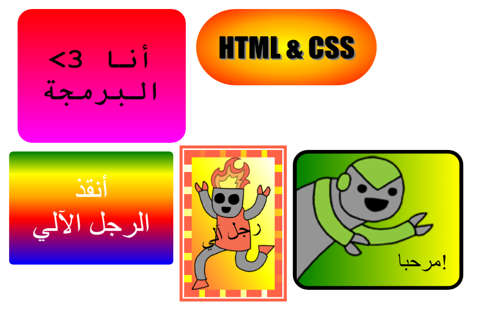

## المقدمة

في هذا المشروع سوف يتم تكوين العديد من الملصقات الممتعة والتي يمكن استخدامها لتزيين صفحات الويب. ستتعلم كيفية استخدام التدرجات اللونية التي تتغير تدريجياً من لون إلى آخر لتبدو الملصقات رائعة.

### معلومات إضافية لقادة النادي

إذا كنت بحاجة إلى طباعة هذا المشروع، فيُرجى استخدام [النسخة القابلة للطباعة](https://projects.raspberrypi.org/ar-SA/projects/stickers/print).

--- collapse ---
---
title: ملاحظات قادة النادي
---

## مقدمة:

في هذا المشروع ، سيتم تعريف الأطفال على التدرجات الخطية والشعاعية في CSS. سيتعلمون أيضًا المزيد عن الحدود وتحديد المواقع.

## الموارد المتوفرة على الإنترنت

لكتابة ملفات HTML & CSS نوصي بإستخدام [trinket](https://trinket.io/). يحتوي هذا المشروع على ملفات trinket التالية:

* [نقطة انطلاق "ملصقات" - jumpto.cc/web-stickers](http://jumpto.cc/web-stickers)

يمكن أن يستخدم الأطفال أيضًا ملف trinket الفارغ هذا [(jumpto.cc/html-blank)](http://jumpto.cc/html-blank) لكتابة ملفات HTML وamp& و CSS، أو يمكنهم استخدام قالب trinket هذا [(jumpto.cc/html-template)](http://jumpto.cc/html-template).

كما يوجد مشروع trinket يحتوي على نموذج حل للتحديات:

* ["مطلوب" انتهى - trinket.io/html/3b3ca05892](https://trinket.io/html/3b3ca05892)

## الموارد المتوفرة دون اتصال بالإنترنت

هذا المشروع يمكن [إكماله دون اتصال بالإنترنت](https://www.codeclubprojects.org/en-GB/resources/webdev-working-offline/) إذا كنت تفضل ذلك. يمكنك الوصول إلى موارد المشروع من خلال النقر فوق رابط "مواد المشروع" الخاص بهذا المشروع. يحتوي هذا الرابط على قسم "موارد المشروع"، الذي يتضمن الموارد التي يحتاج إليها الأطفال لإكمال هذا المشروع من دون اتصال بالإنترنت. تأكد من أن كل طفل لديه حق الوصول إلى نسخة من هذه الموارد. يتضمن هذا القسم الملفات التالية:

* intro/index.html
* template/template.html
* template/style.css
* stickers/index.html
* stickers/style.css
* stickers/script.js
* stickers/robot .png images

يمكنك أيضًا العثور على نسخة كاملة من تحديات هذا المشروع في قسم "موارد المتطوعين" الذي يحتوي على:

* stickers-finished/index.html
* stickers-finished/style.css
* stickers-finished/script.js
* stickers-finished/robot .png images

(جميع الموارد المذكورة أعلاه قابلة للتنزيل أيضًا كملفات `.zip` للمشاريع والمتطوعين)

## أهداف التعلم

* يقدم هذا المشروع استخدام تدرجات CSS لإنشاء تأثيرات مثيرة للاهتمام. سيقوم الطلاب أيضًا بتوسيع معرفتهم لحدود CSS وتحديد المواقع. 

يتناول هذا المشروع عناصر من الصفوف التالية من المناهج الرقمية الخاصة بـ [Raspberry Pi](https://rpf.io/curriculum):

* [التصاميم الأساسية لنماذج ثنائية وثلاثية الأبعاد.](https://www.raspberrypi.org/curriculum/design/creator).

## التحديات

* "إنشاء ملصق تدرج خاص بك" - إضافة تدرجات خطية وشعاعية إلى نص ؛;
* "اصنع المزيد من الملصقات!" - الجمع بين التدرجات مع الصور والنص لإنشاء المزيد من الملصقات.

--- /collapse ---

--- collapse ---
---
title: مواد المشروع
---

## موارد المشروع

* [ملف.zip يحتوي على جميع موارد المشروع](resources/stickers-project-resources.zip)
* [Trinket عبر الانترنت يحتوي على جميع موارد مشروع "Intro"](http://jumpto.cc/web-intro)
* [Trinket عبر الانترنت يحتوي على جميع موارد مشروع "Stickers"](http://jumpto.cc/web-stickers)
* [قالب Trinket عبر الإنترنت](http://jumpto.cc/trinket-template)
* [Trinket فارغ عبر الإنترنت](http://jumpto.cc/trinket-blank)
* [template/index.html](resources/template-index.html)
* [template/style.css](resources/template-style.css)
* [stickers/index.html](resources/stickers-index.html)
* [stickers/style.css](resources/stickers-style.css)
* [stickers/prefixfree.js](resources/stickers-prefixfree.js)
* [stickers/bluerobot.png](resources/stickers-bluerobot.png)
* [stickers/firerobot.png](resources/stickers-firerobot.png)
* [stickers/purplerobot.png](resources/stickers-purplerobot.png)
* [stickers/spacerobot.png](resources/stickers-spacerobot.png)
* [stickers/dogrobot.png](resources/stickers-dogrobot.png)
* [stickers/greenrobot.png](resources/stickers-greenrobot.png)
* [stickers/rainbowrobot.png](resources/stickers-rainbowrobot.png)
* [stickers/yellowrobot.png](resources/stickers-yellowrobot.png)

## موارد قادة النادي

* [ملف.zip يحتوي على جميع موارد المشروع المكتملة](resources/stickers-volunteer-resources.zip)
* [مشروع Trinket المكتمل على الإنترنت](https://trinket.io/html/3b3ca05892)
* [stickers-finished/index.html](resources/stickers-finished-index.html)
* [stickers-finished/style.css](resources/stickers-finished-style.css)
* [stickers-finished/prefixfree.js](resources/stickers-finished-prefixfree.js)
* [stickers-finished/bluerobot.png](resources/stickers-finished-bluerobot.png)
* [stickers-finished/firerobot.png](resources/stickers-finished-firerobot.png)
* [stickers-finished/purplerobot.png](resources/stickers-finished-purplerobot.png)
* [stickers-finished/spacerobot.png](resources/stickers-finished-spacerobot.png)
* [stickers-finished/dogrobot.png](resources/stickers-finished-dogrobot.png)
* [stickers-finished/greenrobot.png](resources/stickers-finished-greenrobot.png)
* [stickers-finished/rainbowrobot.png](resources/stickers-finished-rainbowrobot.png)
* [stickers-finished/yellowrobot.png](resources/stickers-finished-yellowrobot.png)

--- /collapse ---
