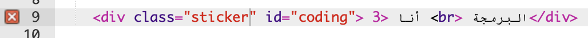
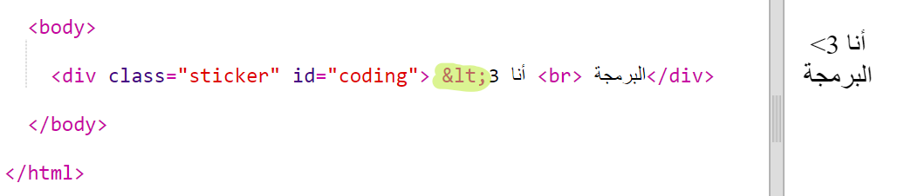
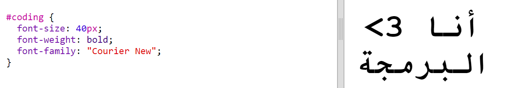
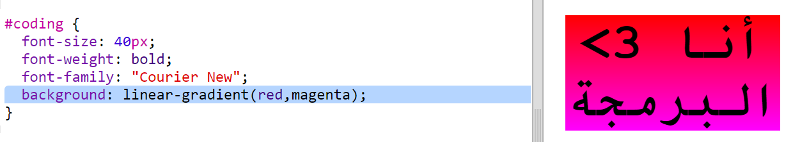
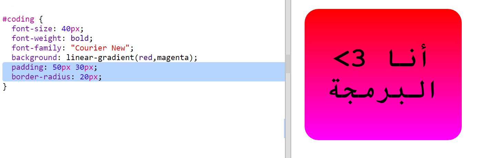

## ملصق برمجة متعدد الألوان

التدرُّج هو تغير تدريجي من لون إلى آخر. ويمكن استخدام التدرجات لإنشاء مؤثرات رائعة. ستستخدم هذه التدرجات لإنشاء ملصقات يمكنك استخدامها في صفحات الويب. 

+ افتح مشروع trinket هذا: <a href="http://jumpto.cc/web-stickers" target="_blank">jumpto.cc/web-stickers</a>. 

	سيكون المشروع بالشكل التالي:

	

+ لننشئ ملصق 'I <3 Coding'. 

	استخدم وسم `
` يتضمن فئة `sticker` ومعرِّف `coding` حتى يمكنك تحديد نمط له: 

	

+ هل لاحظتَ وجود خطأ؟ هذا لأن '>' رمز خاص في لغة HTML. ستحتاج إلى استخدام الكود الخاص `;lt&` بدلًا من '>'. 

	غيِّر التعليمات البرمجية باستخدام `;lt&` ليتم إصلاح الخطأ. 

	

	يعطي الوسم ` ` سطرًا جديدًا. 

لننشئ الآن ملصقًا مشوِّقًا. 

انتقل إلى الملف `style.css`. سترى الفئة `sticker.` موجودة فيه. ستكون وظيفة هذه الفئة هي تخطيط الملصقات في الصفحة وتحديد مركز محتوى هذه الملصقات. 

تذكَّر أنك أضفتَ المعرِّف `coding` إلى الملصق. أضف التعليمات البرمجية التالية في الجزء السفلي من الملف `style.css` لتحديد نمط النص:

+ يمكنك الآن إضافة تدرج إلى خلفية الملصق. يتغير التدرج الخطي من لون إلى آخر بطول خط مستقيم.

	سيتغير هذا التدرج من الأحمر أعلى الملصق إلى الأرجواني أسفل الملصق. أضف تعليمات التدرج البرمجية إلى نمط `coding`:

	

+ يمكنك تحسين مظهر الملصق بإضافة هامش وزوايا مستديرة. 

	أضف التعليمات البرمجية التالية:

	

	يضيف النمط `padding` هامشًا بعرض 50px أعلى الملصق وأسفله، وبعرض 30px يمين الملصق ويساره. 

