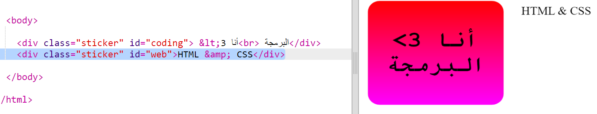
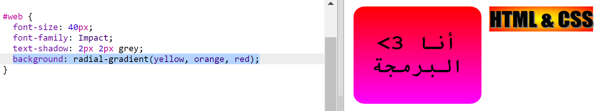
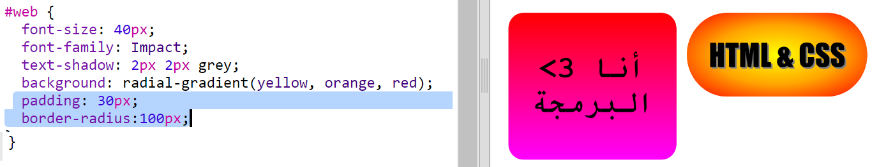

## ملصق HTML & CSS

يمكن للتدرجات أيضًا تغيير اللون بداً من المنتصف نحو الحواف في الخارج، وهذا ما يسمى التدرج الشعاعي.

+ لنقم بإنشاء ملصق مع النص `HTML & CSS.` `&` هو رمز أخر يحتاج إلى ترميز بلغة HTML، الرمز هو `&amp;`.
    
    أضف الكود المظلل لإنشاء ملصق جديد:
    
    

+ انتقل الآن إلى نمط ملف `style.css` واضف نمط للملصق الجديد الخاص بك:
    
    
    
    كود `text-shadow` يضيف الظل الذي يمتد بطول 2 بكسل الى ألاسفل والى يمين النص لجعلها تبرز.

+ الآن بالنسبة للتدرج. هذه المرة دعنا نستخدم التدرج الشعاعي. سيتغير اللون من الأصفر في المنتصف إلى البرتقالي ثم الأحمر.
    
    
    
    لاحظ أن التدرجات يمكن أن تتضمن ألوانًا متعددة ، وليس لونين فقط.

+ سيبدو الملصق أفضل بكثير مع بعض الحشو والحدود الدائرية.
    
    أضف الكود المظلل:
    
    