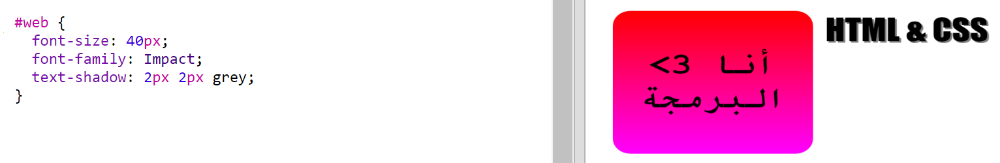

## ملصق HTML & CSS

يمكن أن تغير التدرجات اللون بدءًا من المركز في اتجاه الحواف، وهذا ما يُسمى بالتدرج الشعاعي. 

+ لننشئ ملصقًا نص محتواه هو `HTML & CSS`. و`&` هو رمز آخر يحتاج إلى كود ترميزي في HTML، وهو `;amp&`.

	أضف التعليمة البرمجية المظللة لتنشئ ملصقًا جديدًا: 

	

+ انتقل الآن إلى الملف `style.css` وأضف نمطًا إلى الملصق الجديد:

	

	تضيف التعليمة البرمجية `text-shadow` ظلًا يمتد 2px أسفل النص وإلى يمينه لإبراز هذا النص. 

+ لنعُد إلى التدرج. لنستخدم التدرج الشعاعي هذه المرة. سيتغير اللون من الأصفر، بدءًا من مركز النص، إلى البرتقالي ثم إلى الأحمر. 

	

	لاحظ أن التدرجات يمكن أن تشمل ألوانًا متعددة، لا لونَين فقط. 

+ سيكون الملصق أفضل بكثير عند إضافة مساحة هامش وزوايا مستديرة. 

	أضف التعليمات البرمجية التالية:

	

