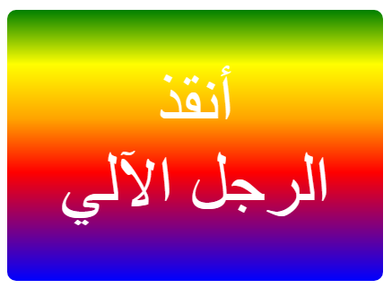

--- challenge ---
## التحدي: أنشئ ملصقًا متدرجًا من ابتكارك

أنشئ الآن ملصقًا متدرجًا من ابتكارك. وجرِّب التدرجَين الخطي والشعاعي مستخدمًا ألوان HTML متعددة. 

ستحتاج إلى:

+ إضافة وسم `
` يتضمن نص الملصق إلى الملف `index.html` وإعطاء الفئة `sticker` معرِّف `id` جديدًا.
+ إضافة نمط إلى المعرِّف `id` الذي اخترته في الملف `style.css`. يمكنك نسخ أحد أنماط الملصقات التي أنشأتها بالفعل ثم تحريره. 

توجد قائمة بكل أسماء الألوان التي يمكنك استخدامها: [jumpto.cc/web-colours](http://jumpto.cc/web-colours)، وهي تشمل أسماء ألوان مثل `tomato` و`firebrick` و`peachpuff`.

إذا كنت تريد تغيير لون النص، فيمكنك استخدام الخاصية `:color`.

إليك مثالًا لما يمكنك فعله باستخدام الألوان المتعددة في التدرج الخطي:

--- /challenge ---