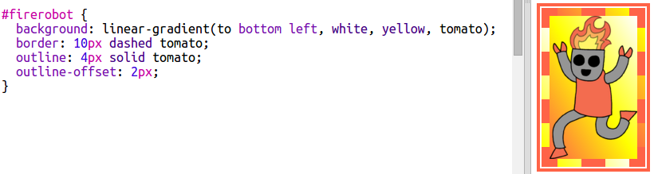
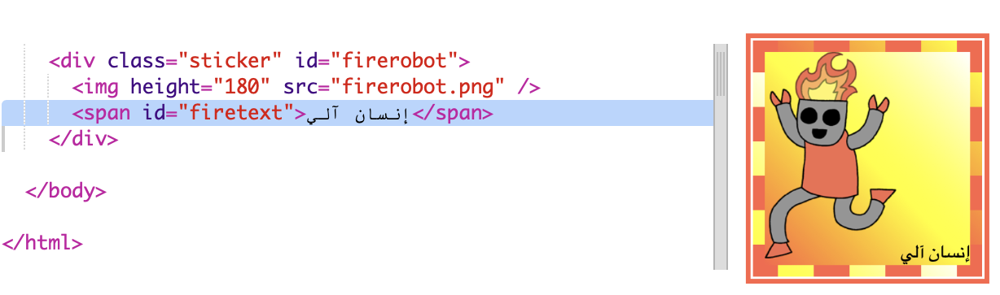
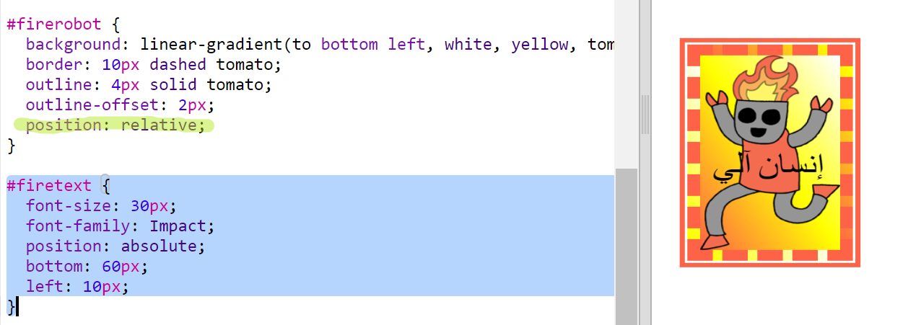
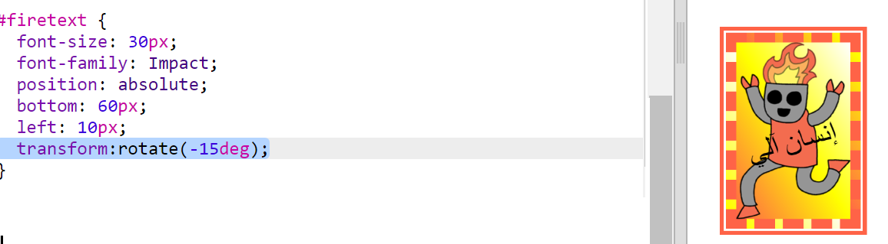

## ملصق روبوت رائع

يمكنك عمل ملصق متدرج اللون باستخدام صورة. إذا استخدمت صورة ذات خلفية شفافة فسيظهر التدرج اللوني.

يمكنك أيضًا إنشاء تدرجات لتعمل في اتجاهات مختلفة.

+ أضف ملصقًا إلى ` index.html ` باستخدام الصورة ` firerobot.png `:
    
    
    
    يمكنك ضبط الارتفاع ` ` لتغيير حجم الصورة ، سيتم تغيير العرض تلقائيًا.

+ عادةً يعمل التدرج الخطي من الأعلى إلى الأسفل ، ولكن يمكنك استخدام ` to ` لتغيير الاتجاه. على سبيل المثال: الى الاعلى `to top`، الى اليسار `to left`، أو الى اليمين `to right`.
    
    للحصول على تدرج قطري ، فإنك تعطي اتجاهين. استخدم كمثال على ذلك إلى أسفل اليسار `to bottom left`.
    
    أضف هذا النمط إلى ` style.css ` لمنح ملصق الروبوت الجديد تدرجًا قطريًا وحدودًا رائعة:
    
    
    
    لاحظ أنه يمكنك استخدام الحدود ` outline` لإنشاء حدود أخرى خارج الحدود المعتادة. `outline-offset` يعطي فراغ بين الحدود والمخطط.

+ دعونا نضيف نص إلى هذا الملصق.
    
    أضف `` يحتوي على النص "روبوت" أو "إنسان آلي" إلى ` index.html ` وقم بتعريفها.
    
    

+ سيبدو النص أفضل إذا قمت بتكبيره واعادة تموضعه.
    
    لوضع النص بمكانه الصحيح، ستحتاج إلى إضافة ` position: relative;` إلى `#greensticker ` و ` position: absolute` إلى ` #greentext`. تتم تغطية الموضع بمزيد من التفاصيل في مشروع ` ابني روبوت `.
    
    أضف النمط التالي إلى الملف `style.css`:
    
    

+ وللتحول النهائي، دعونا ندير النص باستخدام `transform: rotate`.
    
    
    
    حاول تغيير عدد الدرجات التي يتم تدوير النص بها.