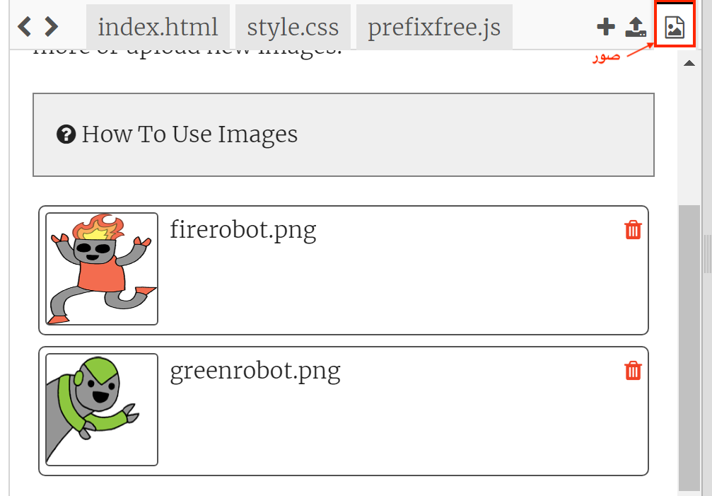
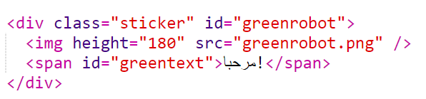
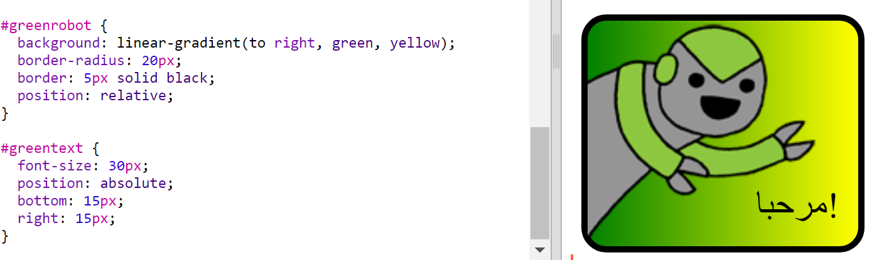

\--- challenge \---

## التحدي: أنشئ ملصقات أخرى

حاول الآن إنشاء المزيد من الملصقات باستخدام اتجاهات تدرجات مختلفة وإضافة الصور والنصوص واستخدام الحدود والمخططات.

نصيحة: ستحتاج إلى إضافة HTML و CSS لكل ملصق.

يمكنك نسخ وتعديل أحد الأمثلة وإجراء تغييرات لإنشاء ملصق جديد.

يتضمن مشروعك بالفعل مجموعة من صور روبوت. انقر على أيقونة الصور لرؤية الصور المتاحة.

يستخدم هذا المثال تدرج خطي مع إلى اليمين `to right`:

\--- /challenge \---