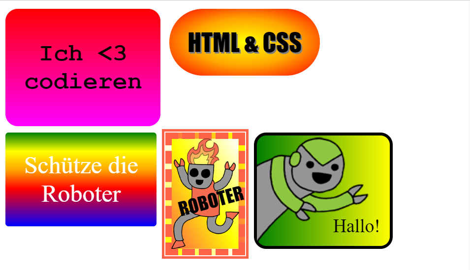

## Einleitung

In this project, you'll create lots of fun stickers that you can use to decorate web pages. You'll learn about using gradients that gradually change from one colour to another to make your stickers look cool.

### Zusätzliche Information für Clubleiter

Falls du dieses Projekt ausdrucken musst, verwende bitte die [druckfreundliche Version](https://projects.raspberrypi.org/en/projects/stickers/print).

## \--- collapse \---

## title: Anmerkungen für Clubleiter

## Einleitung:

In this project, children will be introduced to linear and radial gradients in CSS. They will also learn more about borders and positioning.

## Online-Ressourcen

Wir empfehlen die Verwendung von [trinket](https://trinket.io/) um online HTML & CSS schreiben zu können. Dieses Projekt enthält folgende Trinkets:

* ['Stickers' starting point -- jumpto.cc/web-stickers](http://jumpto.cc/web-stickers)

Die Kinder können auch dieses leere Trinket [(jumpto.cc/html-blank)](http://jumpto.cc/html-blank) verwenden um ihr eigenes HTML & CSS zu schreiben, oder sie können als Alternative dazu dieses Trinket als Vorlage verwenden [(jumpto.cc/html-template)](http://jumpto.cc/html-template).

Es gibt auch ein Trinket mit einer Beispiellösung für die Herausforderungen:

* ['Stickers' Finished -- trinket.io/html/bb4e538e0a](https://trinket.io/html/bb4e538e0a)

## Offline-Ressourcen

Dieses Projekt kann wahlweise auch [offline](https://www.codeclubprojects.org/en-GB/resources/webdev-working-offline/) durchgeführt werden. Sie können auf die Projektressourcen zugreifen, indem Sie auf den Link "Projektmaterial" für dieses Projekt klicken. Dieser Link enthält einen Abschnitt "Projektressourcen" mit Ressourcen, die die Kinder benötigen, um das Projekt offline abschließen zu können. Stelle sicher, dass jedes Kind Zugriff auf eine Kopie dieser Ressourcen hat. Dieser Abschnitt enthält die folgenden Dateien:

* intro/index.html
* template/template.html
* template/style.css
* stickers/index.html
* stickers/style.css
* stickers/script.js
* stickers/robot .png images

Eine vollständige Version dieses Projekts finden Sie auch im Abschnitt "Ressourcen für Freiwillige". Diese enthält:

* stickers-finished/index.html
* stickers-finished/style.css
* stickers-finished/script.js
* stickers-finished/robot .png images

(Alle oben genannten Ressourcen können auch als `.zip`-Dateien für Projekte und für Freiwillige heruntergeladen werden.)

## Lernziele

* This project introduces the use of CSS gradients to create interesting effects. Students will also extend their knowledge of CSS borders and positioning. 

Dieses Projekt deckt die folgenden Kernbereiche des [Raspberry Pi Digital Making Curriculum](http://rpf.io/curriculum) ab:

* [Entwurf von grundlegenden 2D- and 3D-Konstruktionen](https://www.raspberrypi.org/curriculum/design/creator).

## Herausforderungen

* "Create your own gradient sticker" - adding linear and radial gradients to text;
* "Make more stickers!" - Combine gradients with images and text to create more stickers.

\--- /collapse \---

## \--- collapse \---

## title: Projektmaterial

## Projektressourcen

* [.zip-Datei mit allen Projektressourcen](resources/stickers-project-resources.zip)
* [Online Trinket containing all 'Intro' project resources](http://jumpto.cc/web-intro)
* [Online Trinket containing all 'Stickers' project resources](http://jumpto.cc/web-stickers)
* [Online Trinket-Vorlage](http://jumpto.cc/trinket-template)
* [Leeres online-Trinket](http://jumpto.cc/trinket-blank)
* [template/index.html](resources/template-index.html)
* [template/style.css](resources/template-style.css)
* [stickers/index.html](resources/stickers-index.html)
* [stickers/style.css](resources/stickers-style.css)
* [stickers/prefixfree.js](resources/stickers-prefixfree.js)
* [stickers/bluerobot.png](resources/stickers-bluerobot.png)
* [stickers/firerobot.png](resources/stickers-firerobot.png)
* [stickers/purplerobot.png](resources/stickers-purplerobot.png)
* [stickers/spacerobot.png](resources/stickers-spacerobot.png)
* [stickers/dogrobot.png](resources/stickers-dogrobot.png)
* [stickers/greenrobot.png](resources/stickers-greenrobot.png)
* [stickers/rainbowrobot.png](resources/stickers-rainbowrobot.png)
* [stickers/yellowrobot.png](resources/stickers-yellowrobot.png)

## Ressourcen für Clubleiter

* [.zip-Datei mit allen fertig gestellten Projektressourcen](resources/stickers-volunteer-resources.zip)
* [Vollständiges Trinket-Projekt (online)](https://trinket.io/html/bb4e538e0a)
* [stickers-finished/index.html](resources/stickers-finished-index.html)
* [stickers-finished/style.css](resources/stickers-finished-style.css)
* [stickers-finished/prefixfree.js](resources/stickers-finished-prefixfree.js)
* [stickers-finished/bluerobot.png](resources/stickers-finished-bluerobot.png)
* [stickers-finished/firerobot.png](resources/stickers-finished-firerobot.png)
* [stickers-finished/purplerobot.png](resources/stickers-finished-purplerobot.png)
* [stickers-finished/spacerobot.png](resources/stickers-finished-spacerobot.png)
* [stickers-finished/dogrobot.png](resources/stickers-finished-dogrobot.png)
* [stickers-finished/greenrobot.png](resources/stickers-finished-greenrobot.png)
* [stickers-finished/rainbowrobot.png](resources/stickers-finished-rainbowrobot.png)
* [stickers-finished/yellowrobot.png](resources/stickers-finished-yellowrobot.png)

\--- /collapse \---