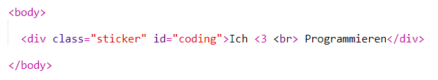
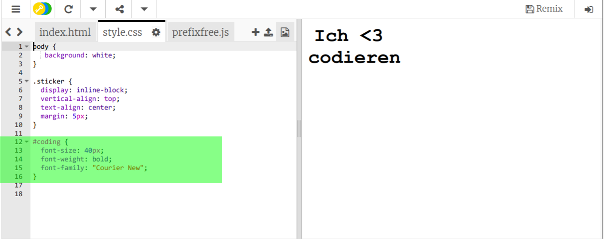
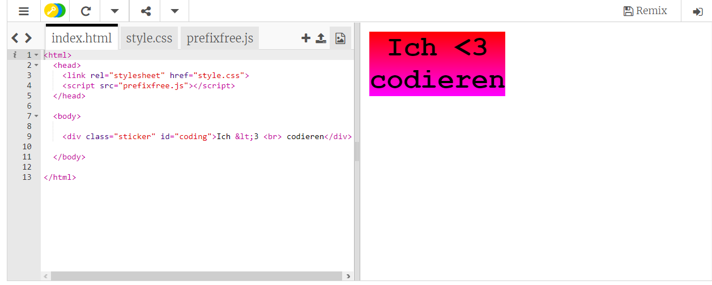
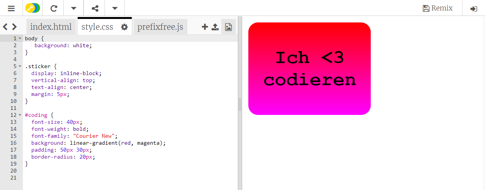

## Farbig kodierte Aufkleber

Ein Gradient ist eine graduelle Veränderung von einer Farbe zur Nächsten. Gradienten können benutzt werden, um coole Effekte zu erzeugen. Du wirst die Gradienten benutzen, um Aufkleber herzustellen, die du dann auf deinen Webseiten benutzen kannst. 

+ Dieses Trinket öffnen: <a href="http://jumpto.cc/web-stickers" target="_blank">jumpto.cc/web-stickers</a>. 

	Das Projekt sollte so aussehen:

	

+ Lass uns einen 'I <3 Coding' Aufkleber anfertigen. 

	Benutze ein `
` mit einer `sticker` (Aufkleber) Klasse und einer `coding` ID, damit du ihn stylen kannst: 

	

+ Hmm, hast du gemerkt dass dir ein Fehler unterlaufen ist? Das liegt daran, dass  '<' ein besonderes Zeichen in HTML ist. Anstatt '<' zu benutzen, musst du den speziellen Code `&lt;` benutzen. 

	Akutalisiere deinen Code, um `&lt;` zu benutzen, damit die Fehlermeldung verschwindet. 

	

	` ` gibt dir eine neue Zeile. 

+ Lass uns jetzt deinen Aufkleber noch interessanter gestalten. 

	Schalte zur `style.css` Datei hinüber. Du wirst sehen, dass dir die `.sticker` (Aufkleber) Klasse hier schon bereitgestellt wurde. Dies wird das Layout der Aufkleber auf der Seite für dich herstellen, sowie den Inhalt automatisch in die Mitte setzen. 

	Denk daran, dass du die ID `coding` zu deinem Aufkleber hinzugefügt hast. Füge unten beim `style.css` den folgenden Code hinzu, um den Text zu stylen:

	

+ Jetzt kannst du einen Gradienten für den Hintergrund des Aufklebers hinzufügen. Ein linearer Gradient ändert sich von einer Farbe zur Nächsten entlang einer geraden Linie.

	Dieser Gradient wird sich von Rot oben zu Magenta unten ändern. Füge den Gradienten-Code zu deinem `coding` Stil hinzu:

	

+ Du kannst das Ergebnis durch Füllung und abgerundete Ecken verbessern. 

	Füge den markierten Code hinzu:

	

	Der `padding` (Füllung) Stil fügt eine Füllung von 50px oben und unten sowie 30px links und rechts hinzu. 
