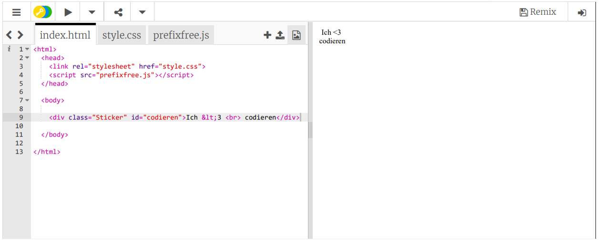

## Farbig kodierte Sticker

Ein Farbverlauf ist ein allmählicher Wechsel von einer Farbe zur anderen. Mit Farbverläufen lassen sich coole Effekte erzielen. Du wirst sie verwenden, um Aufkleber zu erstellen, die du auf deinen Webseiten verwenden kannst.

+ Öffne diesen Trinket: <a href="http://jumpto.cc/web-stickers" target="_blank">jumpto.cc/web-stickers</a>.
    
    Das Projekt sollte so aussehen:
    
    

+ Lass uns einen 'I <3 codierten Sticker' macheng' sticker.
    
    Benutze eine `
` mit einer `sticker` Klasse und einer `Codierung` Id, damit du sie stilisieren kannst:
    
    

+ Hmm hast du gemerkt, dass du einen Fehler hast? Dies liegt daran, dass '<' in HTML ein Sonderzeichen ist. Anstelle von '<' musst du einen Spezialcode verwenden: `&lt;`.
    
    Aktualisiere deinen Code, um `&lt;` zu verwenden, damit der Fehler weggeht.
    
    
    
    ` ` gibt eine neue Zeile aus.

+ Lass uns den Aufkleber jetzt interessant aussehen lassen.
    
    Wechsel in die Datei `style.css`. Du wirst sehen, dass die `.sticker` Klasse für Dich bereitgestellt wurde. Dadurch werden Aufkleber auf der Seite angeordnet und deren Inhalt zentriert.
    
    Denke daran, dass du die Id `coding` zu deinem Sticker hinzugefügt hast. Am Ende von `style.css` fügst du den folgenden Code hinzu, um den Text zu stilisieren:
    
    

+ Jetzt kannnst du einen Farbverlauf für den Hintergrund des Aufklebers hinzufügen. Ein linearer Farbverlauf ändert sich entlang einer geraden Linie von einer Farbe zur anderen.
    
    Dieser Farbverlauf ändert sich von Rot oben nach Magenta unten. Füge den Gradientencode zu deinen `Codierung` Stil hinzu:
    
    

+ Du kannst das Ergebnis verbessern, indem du Auffüllungen und abgerundete Ecken hinzufügst.
    
    Füge den markierten Code hinzu:
    
    
    
    Der `Auffüllungs`-Stil fügt oben und unten eine Auffüllung von 50px und rechts und links 30px hinzu.