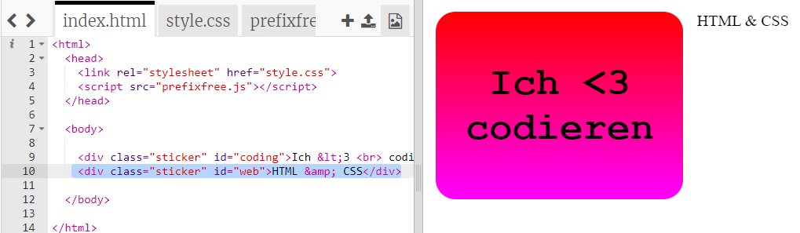
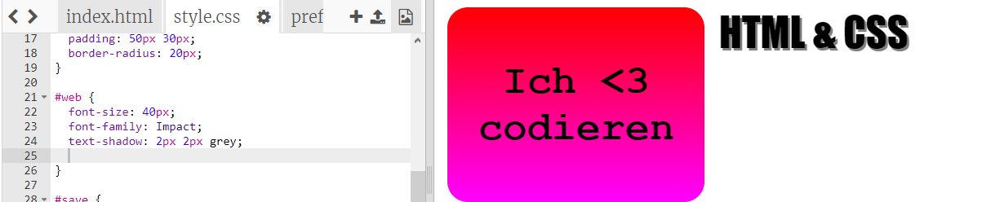
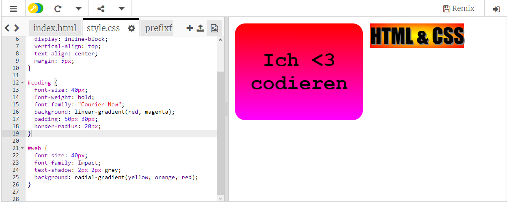
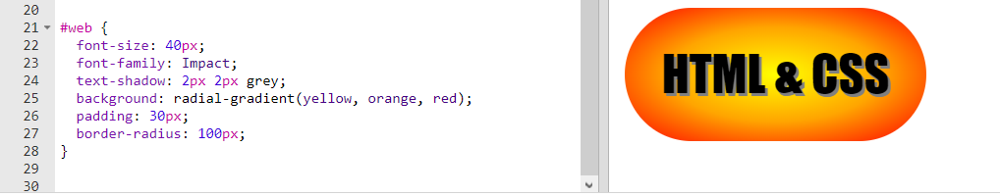

## HTML und CSS Aufkleber

Gradienten können auch die Farbe von der Mitte nach außen hin gehend ändern, dies nennt sich radialer Gradient.  

+ Lass uns einen Aufkleber erstellen mit dem Text `HTML & CSS.` Das  `&` Zeichen ist ein weiteres Zeichen, welches in HTML kodiert werden muss. Der Code ist `&amp;`.

	Füge den markierten Code hinzu, um einen neuen Aufkleber herzustellen: 

	

+ Schalte jetzt zur `style.css` Datei und füge einen Stil für deinen neuen Aufkleber hinzu:

	

	Der `text-shadow` (Textschatten) Code fügt einen Schatten hinzu,  der auf 2px nach unten und nach rechts vom Text verlängert wird, damit dieser noch mehr betont wird. 

+ Jetzt kommen wir zum Gradienten. Diesmal wollen wir einen radialen Gradienten benutzen. Die Farbe wird sich von Gelb in der Mitte über Orange bis hin zu Rot ändern. 

	

	Siehst du, dass die Gradienten mehrere Farben (und nicht bloß zwei) beinhalten können? 

+ Der Aufkleber wird viel besser mit etwas Füllung und einem abgerundeten Rahmen aussehen. 

	Füge den markierten Code hinzu:

	

