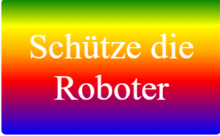

--- challenge ---

## Aufgabe: Erstelle deinen eigenen Gradienten-Aufkleber

Erstelle nun deinen eigenen Gradient-Aufkleber. Probiere lineare und radiale Verläufe mit mehreren HTML-Farben aus.

Dazu musst du:

+ Ein `
` mit deinem Aufkleber-Text zu `index.html` hinzufügen und die `Sticker` Klasse und eine neue `id` geben.
+ Einen Stil für die `id` hinzufügen, den du in `style.css` ausgewählt hast. Du könntest einen der Aufkleber-Stile kopieren, die du bereits erstellt hast, und diese bearbeiten. 

Es gibt eine List von allen Farbnamen, die du benutzen kannst: [umpto.cc/colours](http://jumpto.cc/web-colours), welche Farbnamen wie `tomato`, `firebrick` und `peachpuff` enthält.

Wenn du die Textfarbe ändern möchtest, kannst du `Farbe:` verwenden.

Hier ist ein Beispiel dafür, was du mit mehreren Farben in einem linearen Farbverlauf tun kannst:

--- /challenge ---