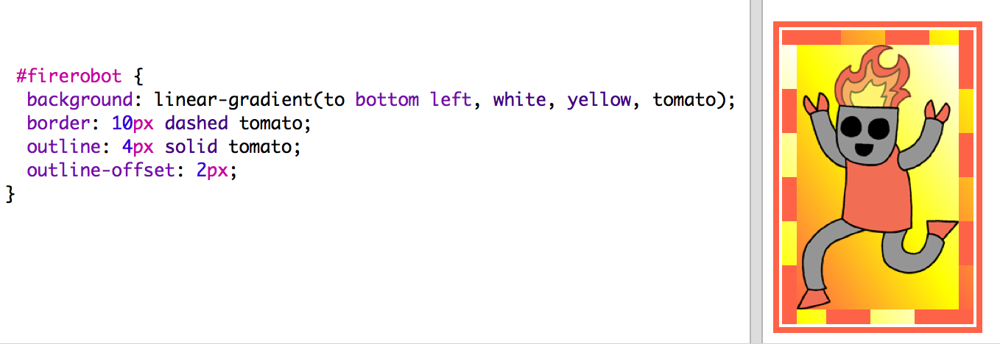
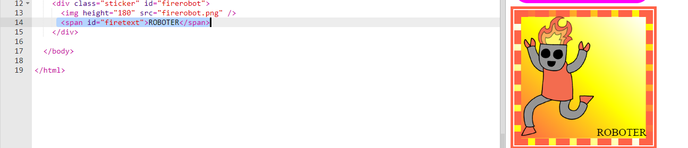
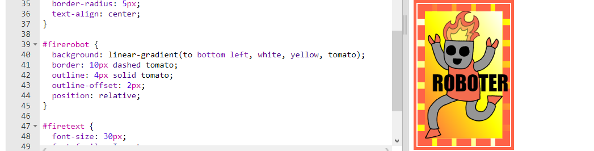
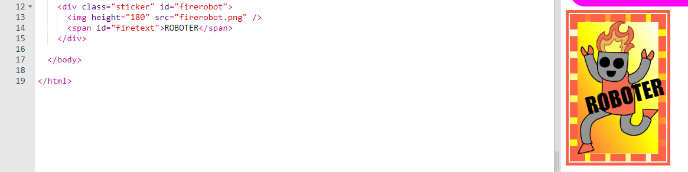

## Ausgefallener Roboter-Aufkleber

Du kannst einen Gradienten-Aufkleber mit einem Bild herstellen. Wenn du ein Bild mit einem transparenten Hintergrund benutzt, dann wird der Gradient diesen durchdringen. 

Du kannst auch Gradienten erstellen, die in verschiedene Richtungen fließen. 

+ Füge einen Aufkleber zu `index.html` (Inhaltsverzeichnis) mit HIlfe des `firerobot.png` (Feuer-Roboter) Bildes:

	

	Du kannst die `height` (Höhe) einstellen, um die Bildgröße zu verändern, die Breite wird sich automatisch ändern. 

+ Normalerweise läuft ein linearer Gradient von oben nach unten, aber du kannst `to` (nach) benutzen, um die Richtung zu ändern. Zum Beispiel: `to top` (nach oben), `to left` (nach links) oder `to right` (nach rechts).

	Für einen diagonalen Gradienten musst du zwei Richtungen angeben. Dieses Beispiel hier benutzt `to bottom left` (nach unten links).

	Füge diesen Stil zum `style.css` hinzu, um deinem neuen Roboteraufkleber einen diagonalen Gradienten und einen witzigen Rahmen zu verleihen:

	

	Bitte beachte, dass du `outline` (Kontur) benutzen kannst, um einen weiteren Rahmen rund um den normalen Rahmen zu erstellen. 
	`outline-offset` (Kontur Versatz) liefert den Freiraum zwischen dem Rahmen und der Kontur. 

+ Lass uns jetzt den Text für diesen Aufkleber hinzufügen. 

	Füge ein `` ein, das den Text „ROBOTER“ enthält, zum `index.html` (Inhaltsverzeichnis) hinzu und gib ihm eine ID. 

	

+ Der Text wird besser aussehen, wenn du ihn größer machst und entsprechend positionierst. 

	Um den Text zu positionieren, musst du `position: relative;` (Position: relativ) zu deinem `#greensticker` (grünen Aufkleber) und auch `position: absolute` (Position: absolut) zu `#greentext` (grüner ‚Text) hinzufügen. Die Positionierung wird im Detail im `Build a Robot` (Baue einen Roboter) Projekt erläutert. 

	Füge den folgenden Code zu `style.css`:

	

+ Und als letzten Schliff können wir den Text mit Hilfe von `transform: rotate` (transformieren: drehen) drehen.

	

	Probiere mal die Gradanzahl, in welcher der Text gedreht wird, zu ändern. 
