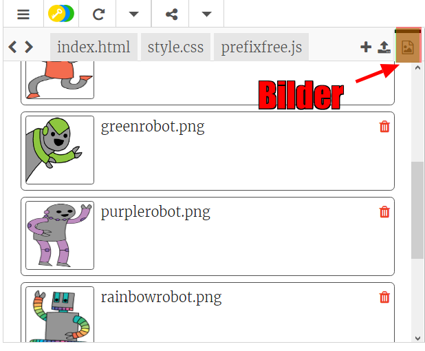
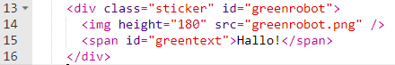
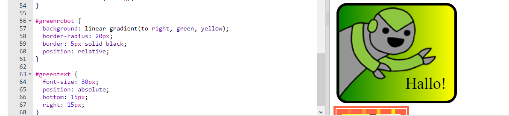

--- challenge ---
## Aufgabe: Noch mehr Aufkleber erstellen

Lass uns jetzt noch mehr Aufkleber mit Hilfe von verschiedenen Gradienten-Richtungen erstellen und Bilder sowie Text hinzufügen und dann auch Rahmen und Konturen benutzen. 

Tipp: Du musst für jeden Aufkleber HTML und CSS hinzufügen. 

Du kannst eins unserer Beispiele kopieren und bearbeiten und Änderungen an dem neuen Aufkleber vornehmen. 

Dein Projekt beinhaltet bereits ein Set an Roboterbildern. Klicke auf das Bilder-Symbol, um die verfügbaren Bilder sehen zu können. 

Dieses Beispiel benutzt einen linearen Gradienten mit `to right` (nach rechts):

--- /challenge ---