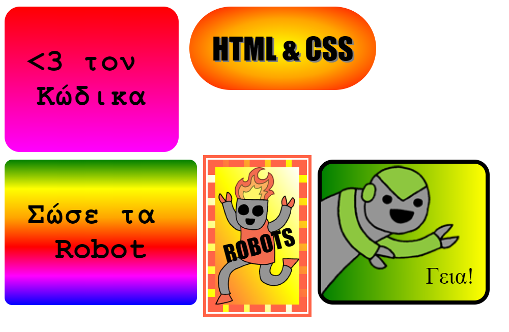

## Εισαγωγή

Σε αυτό το έργο, θα δημιουργήσεις πολλά διασκεδαστικά αυτοκόλλητα που μπορείς να χρησιμοποιήσεις για να διακοσμήσεις ιστοσελίδες. Θα μάθεις να χρησιμοποιείς διαβαθμίσεις που αλλάζουν σταδιακά από το ένα χρώμα στο άλλο για να κάνεις τα αυτοκόλλητα σου εντυπωσιακά.

### Πρόσθετες πληροφορίες για τους αρχηγούς των ομάδων

Αν χρειαστεί να εκτυπώσεις αυτό το έργο, χρησιμοποίησε την [εκτυπώσιμη έκδοση](https://projects.raspberrypi.org/el-GR/projects/stickers/print).

--- collapse ---
---
title: Σημειώσεις συντονιστή ομάδας
---

## Εισαγωγή:

Σε αυτό το πρόγραμμα, τα παιδιά θα εισαχθούν σε γραμμικές και ακτινωτές διαβαθμίσεις (gradients) στο CSS. Θα μάθουν επίσης περισσότερα για τα όρια και την τοποθέτηση.

## Online Πόροι

Συνιστούμε να χρησιμοποιήσετε την εφαρμογή [trinket](https://trinket.io/) για να γράψετε HTML & CSS online. Το έργο αυτό περιλαμβάνει τα ακόλουθα trinkets:

* ['Αυτοκόλλητα' αρχικό στάδιο -- jumpto.cc/web-stickers](http://jumpto.cc/web-stickers)

Τα παιδιά μπορούν επίσης να χρησιμοποιήσουν αυτό το κενό trinket [(jumpto.cc/html-blank)](http://jumpto.cc/html-blank) για να γράψουν το δικό τους HTML & CSS κώδικα, ή εναλλακτικά αυτό το trinket πρότυπο [(jumpto.cc/html-template)](http://jumpto.cc/html-template).

Υπάρχει επίσης ένα trinket που περιέχει μια υποδειγματική λύση στις προκλήσεις:

* ['Αυτοκόλλητα' Ολοκληρωμένο -- trinket.io/html/bb4e538e0a](https://trinket.io/html/64608d0568)

## Offline (εκτός σύνδεσης διαδικτύου) Πόροι

Αυτό το έργο μπορεί να [ολοκληρωθεί χωρίς σύνδεση](https://www.codeclubprojects.org/en-GB/resources/webdev-working-offline/), αν προτιμάς. Μπορείς να αποκτήσεις πρόσβαση στους πόρους του έργου κάνοντας κλικ στον σύνδεσμο 'Υλικό έργου'. Αυτός ο σύνδεσμος περιέχει μια ενότητα 'Πόροι έργου', η οποία περιλαμβάνει πόρους που τα παιδιά θα χρειαστούν για να ολοκληρώσουν αυτό το έργο εκτός σύνδεσης. Βεβαιωθείτε ότι κάθε παιδί έχει πρόσβαση σε ένα αντίγραφο αυτών των πόρων. Αυτή η ενότητα περιλαμβάνει τα ακόλουθα αρχεία:

* intro/index.html
* template/template.html
* template/style.css
* stickers/index.html
* stickers/style.css
* stickers/script.js
* stickers/robot .png images

Μπορείτε επίσης να βρείτε μια ολοκληρωμένη έκδοση των προκλήσεων αυτού του έργου στην ενότητα 'Πόροι εθελοντών', η οποία περιέχει:

* stickers-finished/index.html
* stickers-finished/style.css
* stickers-finished/script.js
* stickers-finished/robot .png images

(Όλοι οι παραπάνω πόροι μπορούν επίσης να μεταφορτωθούν ως συμπιεσμένα `.zip` αρχεία.)

## Στόχοι μάθησης

* Αυτό το έργο εισάγει τη χρήση των διαβαθμίσεων CSS για τη δημιουργία ενδιαφέροντων αποτελεσμάτων. Οι μαθητές θα επεκτείνουν επίσης τις γνώσεις τους σχετικά με τα όρια CSS και την τοποθέτηση. 

Αυτό το έργο περιλαμβάνει στοιχεία από τα παρακάτω μαθήματα του [Raspberry Pi Digital Making Curriculum](https://rpf.io/curriculum):

* [Σχεδιασμός βασικών στοιχείων 2D και 3D](https://www.raspberrypi.org/curriculum/design/creator).

## Προκλήσεις

* "Δημιούργησε το δικό σου διαβαθμισμένο αυτοκόλλητο" - προσθέτοντας γραμμικές και ακτινωτές διαβαθμίσεις στο κείμενο.
* "Κάνε περισσότερα αυτοκόλλητα!" - Συνδύασε διαβαθμίσεις με εικόνες και κείμενο για να δημιουργήσεις περισσότερα αυτοκόλλητα.

--- /collapse ---

--- collapse ---
---
title: Υλικό έργου
---

## Πόροι έργου

* [αρχείο .zip που περιέχει όλους τους πόρους του έργου](resources/stickers-project-resources.zip)
* [Online Trinket που περιέχει όλους τους πόρους του έργου 'Εισαγωγή'](http://jumpto.cc/web-intro)
* [Online Trinket που περιέχει όλους τους πόρους του έργου 'Αυτοκόλλητα'](http://jumpto.cc/web-stickers)
* [Online πρότυπο Trinket](http://jumpto.cc/trinket-template)
* [Online κενό Trinket](http://jumpto.cc/trinket-blank)
* [template/index.html](resources/template-index.html)
* [template/style.css](resources/template-style.css)
* [stickers/index.html](resources/stickers-index.html)
* [stickers/style.css](resources/stickers-style.css)
* [stickers/prefixfree.js](resources/stickers-prefixfree.js)
* [stickers/bluerobot.png](resources/stickers-bluerobot.png)
* [stickers/firerobot.png](resources/stickers-firerobot.png)
* [stickers/purplerobot.png](resources/stickers-purplerobot.png)
* [stickers/spacerobot.png](resources/stickers-spacerobot.png)
* [stickers/dogrobot.png](resources/stickers-dogrobot.png)
* [stickers/greenrobot.png](resources/stickers-greenrobot.png)
* [stickers/rainbowrobot.png](resources/stickers-rainbowrobot.png)
* [stickers/yellowrobot.png](resources/stickers-yellowrobot.png)

## Πόροι συντονιστή ομάδας

* [αρχείο .zip που περιέχει όλους τους πόρους του έργου](resources/stickers-volunteer-resources.zip)
* [Online ολοκληρωμένο έργο στο Τrinket](https://trinket.io/html/64608d0568)
* [stickers-finished/index.html](resources/stickers-finished-index.html)
* [stickers-finished/style.css](resources/stickers-finished-style.css)
* [stickers-finished/prefixfree.js](resources/stickers-finished-prefixfree.js)
* [stickers-finished/bluerobot.png](resources/stickers-finished-bluerobot.png)
* [stickers-finished/firerobot.png](resources/stickers-finished-firerobot.png)
* [stickers-finished/purplerobot.png](resources/stickers-finished-purplerobot.png)
* [stickers-finished/spacerobot.png](resources/stickers-finished-spacerobot.png)
* [stickers-finished/dogrobot.png](resources/stickers-finished-dogrobot.png)
* [stickers-finished/greenrobot.png](resources/stickers-finished-greenrobot.png)
* [stickers-finished/rainbowrobot.png](resources/stickers-finished-rainbowrobot.png)
* [stickers-finished/yellowrobot.png](resources/stickers-finished-yellowrobot.png)

--- /collapse ---
