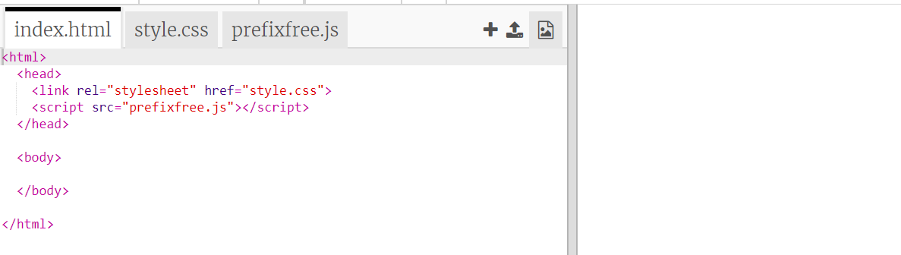
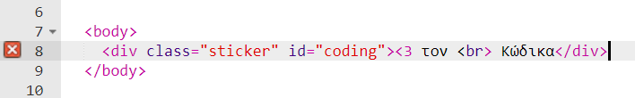
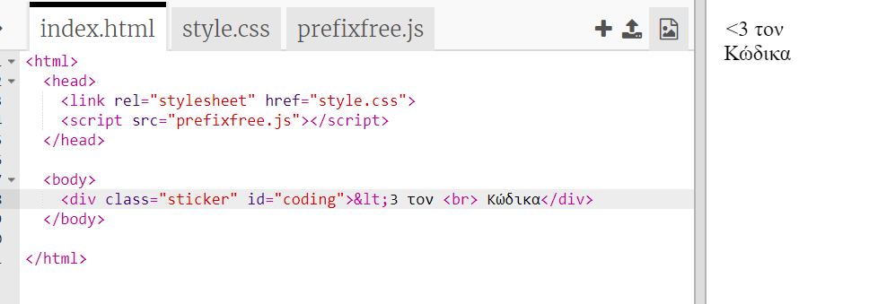
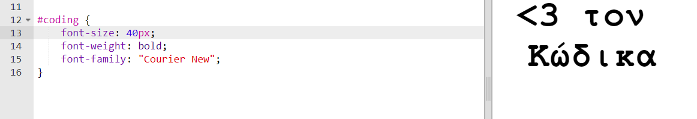
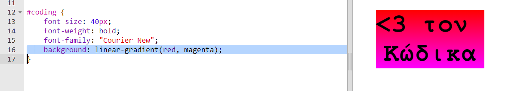
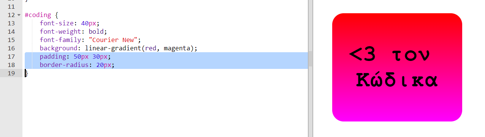

## Πολύχρωμα αυτοκόλλητα κώδικα

Μια διαβάθμιση είναι μια σταδιακή αλλαγή από το ένα χρώμα στο άλλο. Οι διαβαθμίσεις μπορούν να χρησιμοποιηθούν για τη δημιουργία εκπληκτικών εφέ. Θα τα χρησιμοποιήσεις για να δημιουργήσεις αυτοκόλλητα που μπορείς να χρησιμοποιήσεις στις ιστοσελίδες σου.

+ Άνοιξε αυτό το trinket: <a href="http://jumpto.cc/web-stickers" target="_blank">jumpto.cc/web-stickers</a>.
    
    Το έργο/σχέδιο πρέπει να μοιάζει έτσι:
    
    

+ Ας κάνουμε ένα αυτοκόλλητο "<3 τον κώδικα"g' sticker.
    
    Χρησιμοποίησε ένα `
` με μία κλάση `αυτοκόλλητου` και μια ταυτότητα `κώδικα` id ώστε να μπορείς να το μορφοποιήσεις:
    
    

+ Μήπως παρατήρησες ότι σου έβγαλε λάθος; Αυτό συμβαίνει επειδή το '<' είναι ένας ειδικός χαρακτήρας στο HTML. Αντί του '<' πρέπει να χρησιμοποιήσεις τον ειδικό κωδικό `&lt;`.
    
    Ενημέρωσε τον κώδικά σου χρησιμοποιώντας το `&lt;`,έτσι ώστε το σφάλμα να εξαφανιστεί.
    
    
    
    ` ` δίνει μια νέα γραμμή.

+ Τώρα ας κάνουμε το αυτοκόλλητο να φαίνεται ενδιαφέρον.
    
    Πήγαινε στο αρχείο `style.css`. Θα δεις ότι η κλάση `.sticker` έχει δημιουργηθεί για σένα. Αυτή θα τοποθετήσει τα αυτοκόλλητα στη σελίδα και θα κεντράρει το περιεχόμενό τους.
    
    Θυμήσου ότι έχεις προσθέσει την ταυτότητα `κώδικα` στο αυτοκόλλητο. Στο κάτω μέρος του `style.css` πρόσθεσε τον ακόλουθο κώδικα για να μορφοποιήσεις το κείμενο:
    
    

+ Τώρα μπορείς να προσθέσεις μια διαβάθμιση για το φόντο του αυτοκόλλητου. Μια γραμμική διαβάθμιση μεταβάλλεται από το ένα χρώμα στο άλλο κατά μήκος μιας ευθείας γραμμής.
    
    Αυτή η διαβάθμιση θα αλλάξει από κόκκινο στην κορυφή σε (χρώμα) ματζέντα στο κάτω μέρος. Πρόσθεσε τον κώδικα διαβάθμισης στη μορφοποίηση του `κώδικα`:
    
    

+ Μπορείς να βελτιώσεις το αποτέλεσμα προσθέτοντας γεμίσματα και στρογγυλεμένες γωνίες.
    
    Πρόσθεσε τον κώδικα που έχει τονιστεί:
    
    
    
    Η μορφοποίηση `γεμίσματος` προσθέτει γέμισμα 50px στην πάνω και κάτω πλευρά και 30px στα αριστερά και δεξιά.