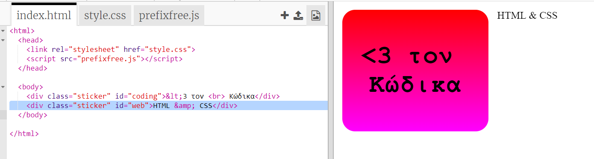
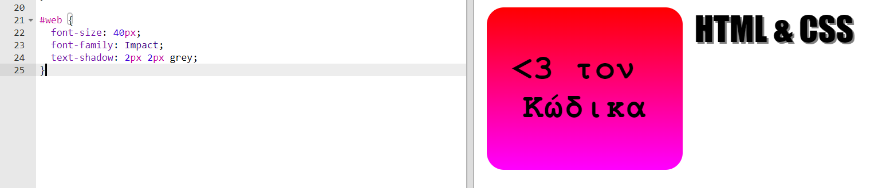
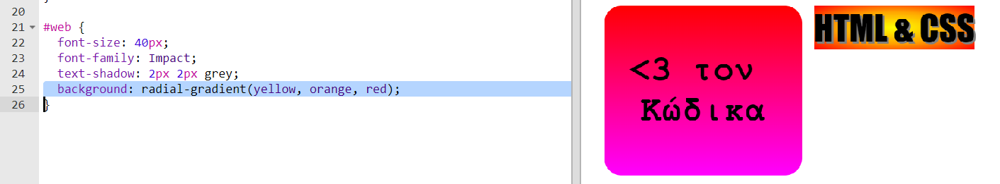
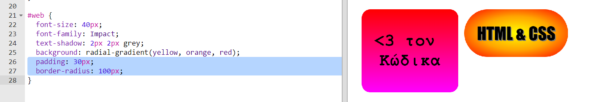

## Αυτοκόλλητο HTML & CSS

Οι διαβαθμίσεις μπορούν επίσης να αλλάξουν χρώμα από το κέντρο προς τα άκρα, αυτό ονομάζεται ακτινωτή κλίση.

+ Ας δημιουργήσουμε ένα αυτοκόλλητο με το κείμενο `HTML & CSS.` Το `&` είναι ένας ακόμη χαρακτήρας που χρειάζεται κωδικοποίηση σε HTML, ο κώδικας είναι `&amp;`.
    
    Πρόσθεσε τον τονισμένο κώδικα για να δημιουργήσεις ένα νέο αυτοκόλλητο:
    
    

+ Τώρα πήγαινε στο αρχείο `style.css` σου και πρόσθεσε μια μορφοποίηση για το νέο σου αυτοκόλλητο:
    
    
    
    Ο κώδικας `text-shadow` προσθέτει μια σκιά που εκτείνεται 2px κάτω και δεξιά από το κείμενο για να ξεχωρίζει.

+ Τώρα όσον αφορά στη διαβάθμιση. Αυτή τη φορά ας χρησιμοποιήσουμε μια ακτινωτή διαβάθμιση. Το χρώμα θα αλλάξει από κίτρινο στο κέντρο σε πορτοκαλί και τελικά σε κόκκινο.
    
    
    
    Παρατήρησε ότι οι διαβαθμίσεις μπορούν να περιλαμβάνουν πολλά χρώματα, όχι μόνο δύο.

+ Το αυτοκόλλητο θα μοιάζει πολύ καλύτερο με κάποιο γέμισμα και ένα στρογγυλεμένο περίγραμμα.
    
    Πρόσθεσε τον κώδικα που έχει τονιστεί:
    
    