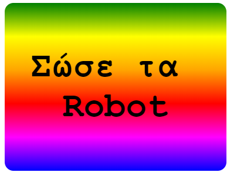

\--- challenge \---

## Πρόκληση: Δημιούργησε το δικό σου διαβαθμισμένο αυτοκόλλητο

Τώρα δημιούργησε το δικό σου διαβαθμισμένο αυτοκόλλητο. Δοκίμασε γραμμικές και ακτινωτές διαβαθμίσεις χρησιμοποιώντας πολλά χρώματα HTML.

Θα χρειαστεί:

+ Να προσθέσεις ένα `
` με το κείμενο του αυτοκόλλητου στο `index.html` και να του δώσεις την κλάση του `αυτοκόλλητου` και μια νέα `ταυτότητα`.
+ Πρόσθεσε μορφοποίηση για την `ταυτότητα` που επέλεξες στο `style.css` . Θα μπορούσες να αντιγράψεις μια από τις μορφοποιήσεις αυτοκόλλητων που έχεις ήδη δημιουργήσει και να τις επεξεργαστείς. 

Υπάρχει μια λίστα με όλα τα ονόματα των χρωμάτων που μπορείς να χρησιμοποιήσεις: [jumpto.cc/web-colours](http://jumpto.cc/web-colours), η οποία περιλαμβάνει ονόματα όπως `tomato`, `firebrick` και `peachpuff`.

Αν θέλεις να αλλάξεις το χρώμα κειμένου, μπορείς να χρησιμοποιήσεις το `color:`.

Ακολουθεί ένα παράδειγμα του τι που μπορείς να κάνεις με πολλά χρώματα σε γραμμική διαβάθμιση:

\--- /challenge \---