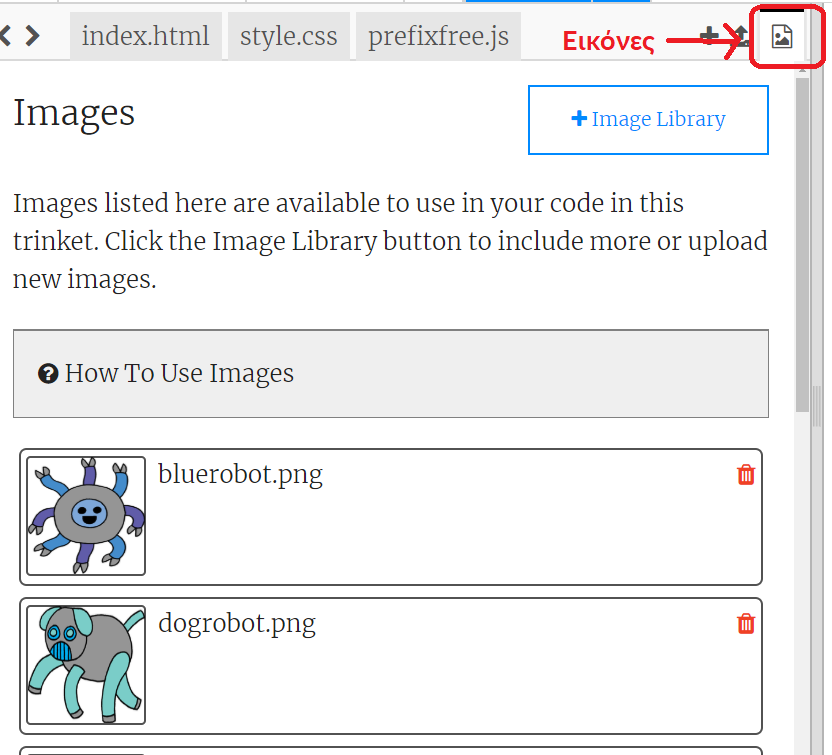
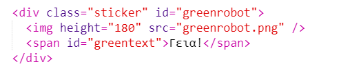
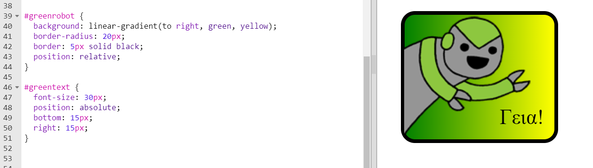

--- challenge ---

## Πρόκληση: Φτιάξε περισσότερα αυτοκόλλητα

Τώρα δοκίμασε να δημιουργήσεις περισσότερα αυτοκόλλητα χρησιμοποιώντας διαφορετικές κατευθύνσεις διαβαθμίσεων και προσθέτοντας εικόνες και κείμενο και χρησιμοποιώντας όρια και περιγράμματα.

Συμβουλή: Θα χρειαστεί να προσθέσεις HTML και CSS για κάθε αυτοκόλλητο.

Μπορείς να αντιγράψεις και να επεξεργαστείς ένα από τα παραδείγματα σου και να κάνεις αλλαγές για να δημιουργήσεις ένα νέο αυτοκόλλητο.

Το έργο σου περιλαμβάνει ήδη ένα σύνολο από εικόνες ρομπότ. Κάνε κλικ στο εικονίδιο εικόνων για να δεις τις διαθέσιμες εικόνες.

Αυτό το παράδειγμα χρησιμοποιεί γραμμική διαβάθμιση με `προς τα δεξιά`:

--- /challenge ---

***
Το έργο αυτό μεταφράστηκε από τους εθελοντές:

**Μάνος Ζεάκης**

**Κυριακή Ιντζεΐδου**

Χάρη στους εθελοντές, μπορούμε να δώσουμε σε ανθρώπους σε όλο τον κόσμο την ευκαιρία να μάθουν στη γλώσσα τους. Μπορείτε να μας βοηθήσετε να προσεγγίσουμε περισσότερους ανθρώπους μεταφράζοντας εθελοντικά - περισσότερες πληροφορίες στο [rpf.io/translate](https://rpf.io/translate).