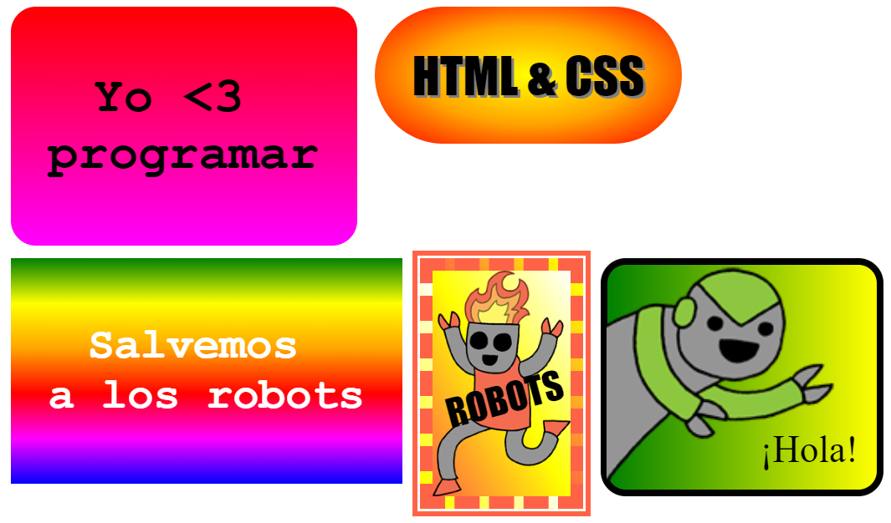

## Introducción

En este proyecto, crearás muchas pegatinas divertidas que puedes usar para decorar páginas web. Aprenderás a utilizar degradados que cambian gradualmente de un color a otro para hacer que las pegatinas se vean bien.

### Información adicional para líderes de club

Si necesitas imprimir este proyecto, usa la [versión para imprimir](https://projects.raspberrypi.org/en/projects/stickers/print).

## \--- collapse \---

## título: Notas del líder del club

## Introducción:

En este proyecto, los niños tendrán una introducción a gradientes lineales y radiales en CSS. También aprenderán más sobre los bordes y el posicionamiento.

## Recursos en línea

Recomendamos el uso de [ trinket](https://trinket.io/) para escribir HTML & CSS en línea. Este proyecto contiene los siguientes trinkets:

* ['Stickers' punto de inicio -- jumpto.cc/web-stickers](http://jumpto.cc/web-stickers)

Los niños también pueden hacer uso de este trinket en blanco [(jumpto.cc/html-blank)](http://jumpto.cc/html-blank) para escribir su propio HTML & CSS, o alternativamente pueden usar esta plantilla de trinket [(jumpto.cc/html-template)](http://jumpto.cc/html-template).

También hay un Trinket que contiene una solución de muestra a los desafíos:

* ['Pegatinas' terminado -- trinket.io/html/bb4e538e0a](https://trinket.io/html/bb4e538e0a)

## Recursos sin conexión

This project can be [completed offline](https://rpf.io/html-offline) if preferred. Se puede acceder a los recursos del proyecto haciendo clic en el enlace 'Materiales del proyecto' para este proyecto. Este enlace contiene una sección de 'Recursos del proyecto', que incluye los recursos que los niños necesitarán para completar este proyecto sin conexión. Asegúrese de que cada niño tenga acceso a una copia de estos recursos. Esta sección incluye los siguientes archivos:

* intro/index.html
* template/template.html
* template/style.css
* stickers/index.html
* stickers/style.css
* stickers/script.js
* stickers/robot .png images

También puedes encontrar una versión completa de los desafíos de este proyecto en la sección 'Recursos para voluntarios', que contiene:

* stickers-finished/index.html
* stickers-finished/style.css
* stickers-finished/script.js
* stickers-finished/robot .png images

(Todos los recursos anteriores también se pueden descargar como archivos `.zip` de proyectos y voluntarios.)

## Objetivos del Aprendizaje

* Este proyecto introduce el uso de gradientes CSS para crear efectos interesantes. Los estudiantes también ampliarán sus conocimientos de fronteras y posicionamiento CSS. 

This project covers elements from the following strands of the [Raspberry Pi Digital Making Curriculum](https://rpf.io/curriculum):

* [Diseño de elementos básicos en 2D y 3D](https://www.raspberrypi.org/curriculum/design/creator).

## Desafíos

* "Crea tu propia pegatina de gradiente" - añadiendo gradientes lineales y radiales al texto;
* "¡Haz más pegatinas!" - Combina los gradientes con imágenes y texto para crear más pegatinas.

\--- /collapse \---

## \--- collapse \---

## title: Materiales del proyecto

## Recursos del proyecto

* [Archivo .zip que contiene todos los recursos del proyecto](https://rpf.io/p/en/stickers-go)
* [Trinket en línea que contiene todos los recursos del proyecto "Intro"](http://jumpto.cc/web-intro)
* [Trinket en línea que contiene todos los recursos del proyecto "Pegatinas"](http://jumpto.cc/web-stickers)
* [Plantilla Trinket en línea](http://jumpto.cc/trinket-template)
* [Trinquet en línea en blanco](http://jumpto.cc/trinket-blank)
* [template/index.html](resources/template-index.html)
* [template/style.css](resources/template-style.css)
* [stickers/index.html](resources/stickers-index.html)
* [stickers/style.css](resources/stickers-style.css)
* [stickers/prefixfree.js](resources/stickers-prefixfree.js)
* [stickers/bluerobot.png](resources/stickers-bluerobot.png)
* [stickers/firerobot.png](resources/stickers-firerobot.png)
* [stickers/purplerobot.png](resources/stickers-purplerobot.png)
* [stickers/spacerobot.png](resources/stickers-spacerobot.png)
* [stickers/dogrobot.png](resources/stickers-dogrobot.png)
* [stickers/greenrobot.png](resources/stickers-greenrobot.png)
* [stickers/rainbowrobot.png](resources/stickers-rainbowrobot.png)
* [stickers/yellowrobot.png](resources/stickers-yellowrobot.png)

## Recursos para los líderes de clubes

* [Archivo .zip que contiene todos los recursos de proyecto terminado](https://rpf.io/p/en/stickers-go)
* [Proyecto Trinket terminado en línea](https://trinket.io/html/bb4e538e0a)
* [stickers-finished/index.html](resources/stickers-finished-index.html)
* [stickers-finished/style.css](resources/stickers-finished-style.css)
* [stickers-finished/prefixfree.js](resources/stickers-finished-prefixfree.js)
* [stickers-finished/bluerobot.png](resources/stickers-finished-bluerobot.png)
* [stickers-finished/firerobot.png](resources/stickers-finished-firerobot.png)
* [stickers-finished/purplerobot.png](resources/stickers-finished-purplerobot.png)
* [stickers-finished/spacerobot.png](resources/stickers-finished-spacerobot.png)
* [stickers-finished/dogrobot.png](resources/stickers-finished-dogrobot.png)
* [stickers-finished/greenrobot.png](resources/stickers-finished-greenrobot.png)
* [stickers-finished/rainbowrobot.png](resources/stickers-finished-rainbowrobot.png)
* [stickers-finished/yellowrobot.png](resources/stickers-finished-yellowrobot.png)

\--- /collapse \---