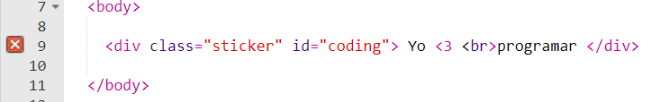
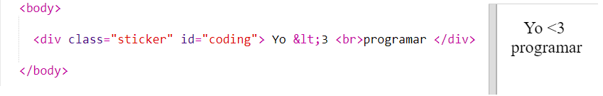
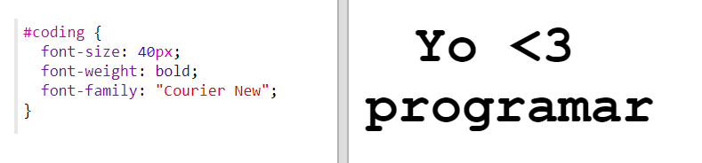
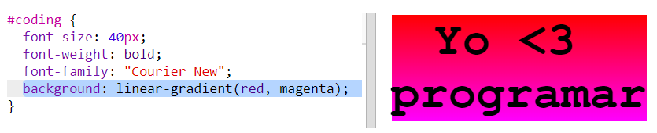
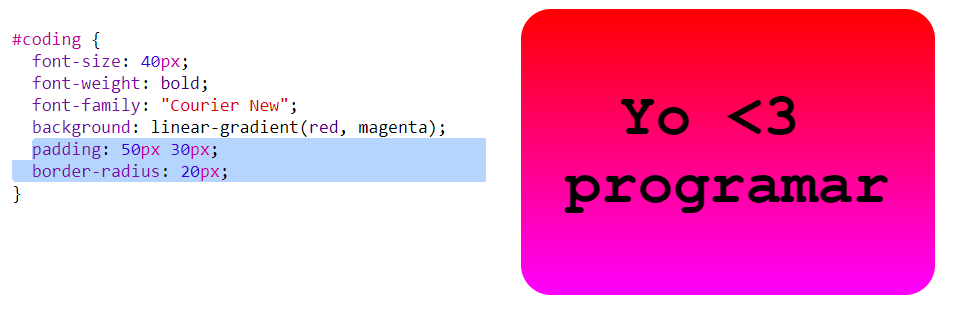

## Colourful coding sticker

A gradient is a gradual change from one colour to another. Gradients can be used to create cool effects. You're going to use them to create stickers that you can use on your web pages.

+ Open this trinket: <a href="http://jumpto.cc/web-stickers" target="_blank">jumpto.cc/web-stickers</a>.
    
    The project should look like this:
    
    

+ Hagamos un codín 'I <3g' sticker.
    
    Utilice un `
` con una clase `sticker` y una Identificación `coding` para que puedas darle estilo:
    
    

+ Hmm, ¿notaste que recibiste un error? Esto se debe a que '<' es un carácter especial en HTML. En lugar de '<' necesitas usar el código especial `&lt; `.
    
    Actualiza tu código usando `&lt; ` para que el error desaparezca.
    
    
    
    ` ` da una nueva línea.

+ Ahora vamos a hacer que la pegatina se vea interesante.
    
    Cambia al archivo ` style.css`. Verás que ya tienes la clase `.sticker `. Esto diseñará pegatinas en la página y centrará su contenido.
    
    Recuerda que agregaste el la identificación `coding` a tu pegatina. En la parte inferior de ` style.css ` agrega el siguiente código para darle estilo al texto:
    
    

+ Ahora puedes agregar un degradado para el fondo de la etiqueta. Un degradado lineal cambia de un color a otro a lo largo de una línea recta.
    
    Este degradado cambiará de rojo en la parte superior a magenta en la parte inferior. Agrega el código de gradiente a tu estilo `coding`:
    
    

+ Puede mejorar el resultado agregando espacio alrededor y esquinas redondeadas.
    
    Agregua el código resaltado:
    
    
    
    El estilo `padding` agrega espacio de 50px en la parte superior e inferior y 30px a la izquierda y a la derecha.