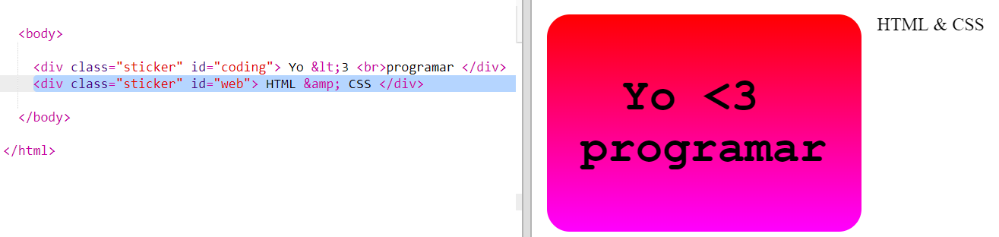
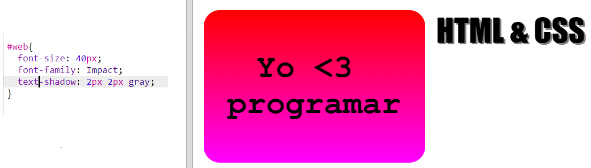
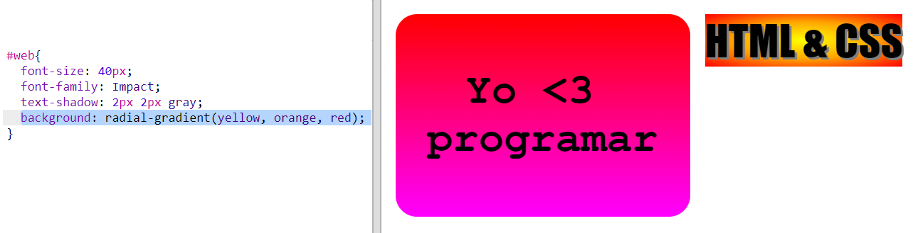
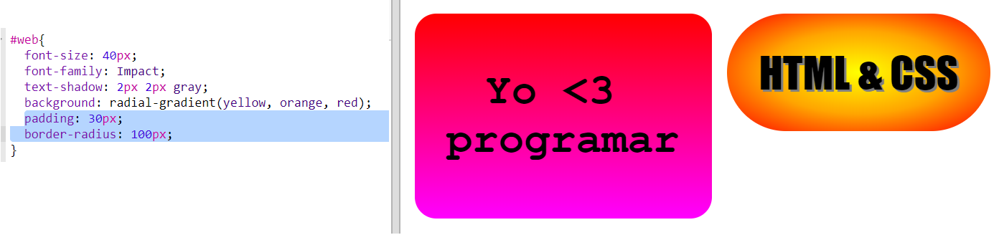

## Pegatina HTML & CSS

Los gradiente también pueden cambiar de color desde el centro hacia los bordes, esto se denomina gradiente radial.

+ Vamos a crear una etiqueta con el texto `HTML & CSS.` `&` es otro carácter que necesita codificación en HTML, el código es `&amp;`.
    
    Agrega el código resaltado para crear una nueva etiqueta:
    
    

+ Ahora cambia a tu archivo `style.css` y añade un estilo para tu nueva etiqueta:
    
    
    
    El código `text-shadow` agrega una sombra que se extiende 2px debajo y a la derecha del texto para resaltarlo.

+ Ahora el gradiente. Esta vez utilicemos un gradiente radial. El color cambiará de amarillo en el centro hasta naranja y luego rojo.
    
    
    
    Ten en cuenta que los gradientes pueden incluir varios colores, no solo dos.

+ La pegatina se verá mucho mejor con un poco de espacio y un borde redondeado.
    
    Agrega el código resaltado:
    
    