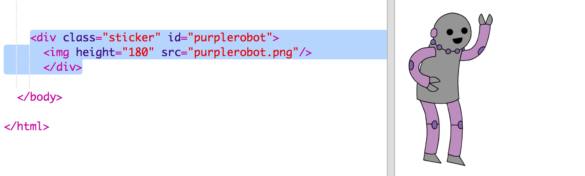
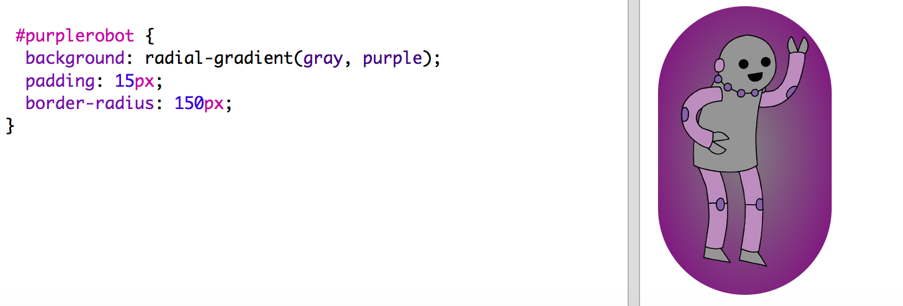

## Crea una pegatina con degradado que contenga una imagen

También puedes crear una pegatina con degradado usando una imagen. Si usas una imagen con el fondo transparente, el degradado se verá a través de la imagen. 

+ Primero, vamos a crear una pegatina que incluya una imagen. 

	Tu proyecto incluye una imagen que se llama `purplerobot.png`.

	Añade el código resaltado a `index.html`:

	

	Puedes ajustar la `altura` (height) para cambiar el tamaño de la imagen, el ancho cambiará automáticamente. 

+ A continuación, añade el código de estilo para crear un fondo degradado en tu pegatina con imagen:

	

##Desafío: Crea tu propia pegatina con una imagen 

Ahora vas a crear tu propia pegatina de imagen con efecto degradado. 

Tendrás que:

+ Añadir en `index.html` un nuevo `
` de pegatina que incluya una imagen. 
+ Añadir la categoría `sticker` y un nuevo id al div de pegatina.
+ Crear un estilo para el nuevo id con degradado y relleno. 

El proyecto incluye una serie de imágenes de robots. Haz clic en el icono de imágenes para ver cuáles están disponibles. 

Este es un ejemplo de una pegatina con imagen y degradado lineal:

