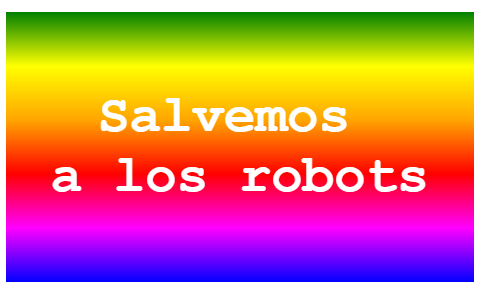

\--- challenge \---

## Desafío: crea tu propia etiqueta con degradado

Ahora haz tu propia etiqueta con degradado. Prueba los degradados lineales y radiales utilizando múltiples colores HTML.

Tendrás que:

+ Agregar un `
` con el texto de tu pegatinaa ` index.html ` y darle la clase `sticker` y un nuevo ` id `.
+ Añade estilo para la identificación `id` que elegiste en ` style.css `. Puedes copiar uno de los estilos de etiqueta que ya has creado y editarlo. 

Hay una lista de todos los nombres de colores que puedes usar: [ jumpto.cc/web-colours ](http://jumpto.cc/web-colours), que incluye nombres de colores como ` tomato`, ` firebrick ` y ` peachpuff`.

Si deseas cambiar el color del texto, puede usar `color:`.

Este es un ejemplo de lo que puedes hacer con varios colores en un degradado lineal:

\--- /challenge \---