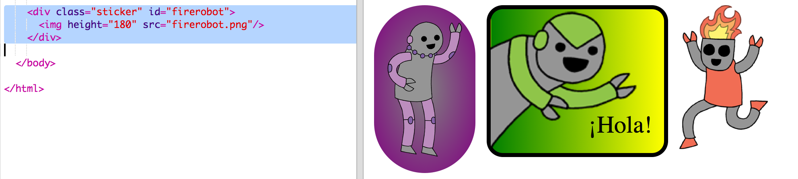

## Pegatina lujosa de un robot

Puedes hacer una pegatina con gradiente utilizando una imagen. Si utilizas una imagen con un fondo transparente, el gradiente se verá a través de él.

También puedes crear gradiente que van en diferentes direcciones.

+ Añade una pegatina a `index.html` utilizando la imagen `firerobot.png`:
    
    
    
    Puedes ajustar `altura` para redimensionar la imagen, el ancho cambiará automáticamente.

+ Normalmente, un degradado lineal se ejecuta de arriba a abajo, pero puedes usar `hacia` para cambiar la dirección. Por ejemplo: `hacia arriba`, `hacia izquierda` o `hacia derecha`.
    
    Para un gradiente diagonal se dan dos direcciones. Este ejemplo usa `hacia abajo izquierda`.
    
    Agrega este estilo a `style.css` para darle a tu nueva pegatina de robot un gradiente diagonal y un borde elegante:
    
    
    
    Ten en cuenta que puedes utilizar `contorno` para crear otro borde por fuera del habitual. `espacio-contorno` da la separación entre el borde y el contorno.

+ Añadamos algo de texto a esta pegatina.
    
    Agrega un `` que contenga el texto "ROBOTS" a `index.html` y dale un id.
    
    

+ El texto se verá mejor si lo haces más grande y lo posicionas.
    
    Para posicionar el texto, debes agregar `position: relative;` a `#greensticker` y `position: absolute` a `#greentext`. El posicionamiento se trata con más detalle en el proyecto `Construye un robot`.
    
    Agrega el siguiente código a `style.css`:
    
    

+ Y para el detalle final, giremos el texto usando `transform: rotate`.
    
    
    
    Intenta cambiar el número de grados en que se gira el texto.