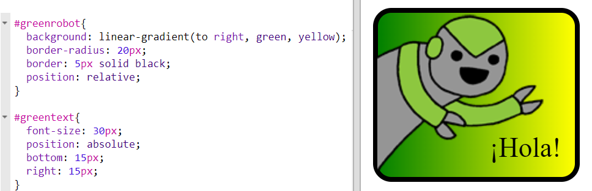

## Degradados horizontales

Los degradados también pueden ser horizontales además de verticales. 

+ Vamos a crear una nueva pegatina con imagen. 

	Esta vez vamos a usar la imagen `greenrobot.png`. Añade este código a `index.html`:

	

+ Normalmente un degradado lineal va de arriba abajo, pero si escribimos `to right` (hacia la derecha), haremos que vaya de izquierda a derecha. 

	Añade el código resaltado en `style.css` para incluir un degradado horizontal en la pegatina del robot verde. 

	

	Fíjate que el degradado cambia de verde en la izquierda a amarillo en la derecha. 

+ Parece que este robot quiere decir algo. Vamos a añadir texto a la pegatina. 

	En la pestaña `index.html` escribe el texto '¡Hola!' en la pegatina del robot verde. Escríbelo dentro de un `` con un id para poder asignarle un estilo:  

	

+ El texto se verá mejor si lo hacemos más grande y definimos su posición. 

	Para definir la posición del texto tendrás que añadir `position: relative;` (posición: relativa) en `#greensticker` y `position: absolute` (posición absoluta) en `#greentext`. Esto se explica con más detalle en el proyecto `Construye un robot`. 

	Añade el código resaltado en la pestaña `style.css`:

	

	Ahora el texto '¡Hola!' está situado en relación a la esquina inferior derecha de la pegatina. 
