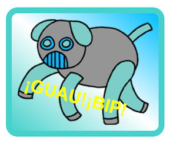

## Degradados diagonales

También puedes crear degradados diagonales que van de esquina a esquina. 

+ Añade una pegatina en `index.html` usando la imagen `firerobot.png`:

	

+ Con un degradado diagonal damos dos direcciones. El ejemplo usa `to bottom left` (hacia abajo e izquierda).

	Añade este estilo en `style.css` para dar a tu nueva pegatina de robot un degradado diagonal y un borde original:

	

	Fíjate que puedes usar `outline` (contorno) para crear otro borde por fuera del habitual. 
	`outline-offset` (compensación de contorno) incluye un espacio entre el borde y el contorno. 

+ Vamos a añadir texto a esta pegatina. 

	Añade un `` con el texto "ROBOTS" en `index.html`, y asígnale un id. 

	

+ A continuación puedes decidir la posición del texto si añades el siguiente estilo:

	

+ Y para darle el último toque, vamos a rotar el texto con `transform: rotate` (transformar: rotar).

	

	Intenta cambiar el número de grados de rotación del texto.

##Desafío: Más pegatinas

Intenta crear más pegatinas usando diferentes direcciones para el degradado, añadiendo imágenes y texto y usando bordes y contornos. 

Puedes copiar uno de los ejemplos y hacer cambios para crear una nueva pegatina. 

Mira este ejemplo en el que hemos usado un degradado diagonal:

