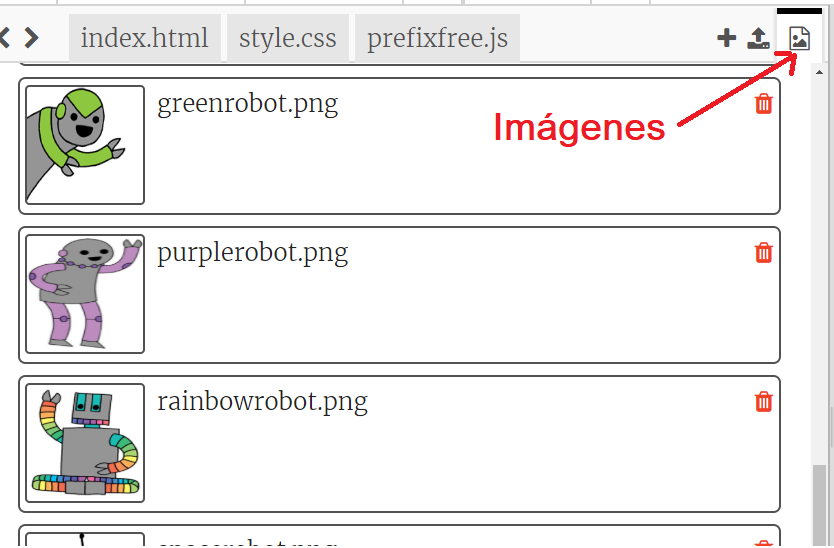
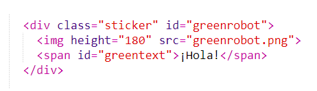
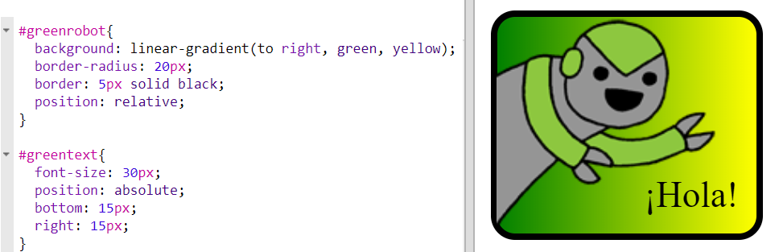

--- challenge ---

## Desafío: haz más pegatinas

Ahora intenta hacer más pegatinas usando diferentes direcciones de gradiente, agregando imágenes y texto y utilizando bordes y contornos.

Consejo: Deberás agregar HTML y CSS para cada pegatina.

Puedes copiar y editar uno de los ejemplos y hacer cambios para crear una nueva pegatina.

Tu proyecto ya incluye un conjunto de imágenes de robot. Haz clic en el icono de imágenes para ver las imágenes disponibles.

Este ejemplo utiliza un gradiente lineal con `to right (hacia derecha)`:

--- /challenge ---

**Traducción aportada por la comunidad**

Este proyecto fue traducido por **Laura Lurati** y revisado por **Sara Conde**.

Nuestros increíbles voluntarios de traducción nos ayudan a dar a los niños de todo el mundo la oportunidad de aprender a programar. Puedes ayudarnos a llegar a más niños traduciendo nuestros proyectos. Consigue más información en [rpf.io/translate](https://rpf.io/translate).