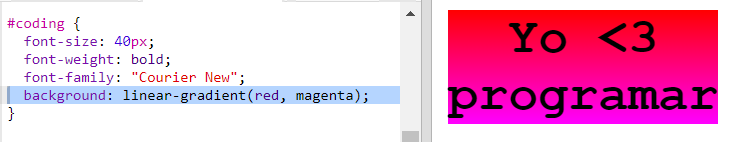

## Sticker colorido de programación

Un degradado o gradiente es un cambio gradual de un color a otro. Los gradientes se pueden utilizar para crear efectos geniales. Los vas a utilizar para crear stickers que puedes usar en tus páginas web.

+ Abre este trinket: <a href="http://jumpto.cc/web-stickers" target="_blank">jumpto.cc/web-stickers</a>.
    
    El proyecto debería parecerse a esto:
    
    

+ Hagamos un sticker 'Yo <3 Programar'g' sticker.
    
    Utiliza un `
` con una clase `sticker` y un identificador `coding` para que puedas darle estilo:
    
    

+ Mmm, ¿notaste que recibiste un error? Esto se debe a que '<' es un carácter especial en HTML. En lugar de '<' necesitas usar el código especial `&lt;`.
    
    Actualiza tu código usando `&lt;` para que el error desaparezca.
    
    
    
    ` ` da una nueva línea.

+ Ahora vamos a hacer que el sticker se vea interesante.
    
    Cambia al archivo `style.css`. Verás que la clase `.sticker` ha sido proporcionada para ti. Esto colocará los stickers en la página y centrará su contenido.
    
    Recuerda que agregaste el identificador `coding` a tu sticker. En la parte inferior de `style.css` agrega el siguiente código para darle estilo al texto:
    
    

+ Ahora puedes agregar un degradado para el fondo del sticker. Un degradado lineal cambia de un color a otro a lo largo de una línea recta.
    
    Este degradado cambiará de rojo en la parte superior a magenta en la parte inferior. Agrega el código de degradado a tu estilo `coding`:
    
    

+ Puedes mejorar el resultado agregando espacio alrededor y redondeando las esquinas.
    
    Agrega el código resaltado:
    
    
    
    El estilo `padding` agrega un espacio de 50px en la parte superior e inferior y 30px en la parte izquierda y derecha.