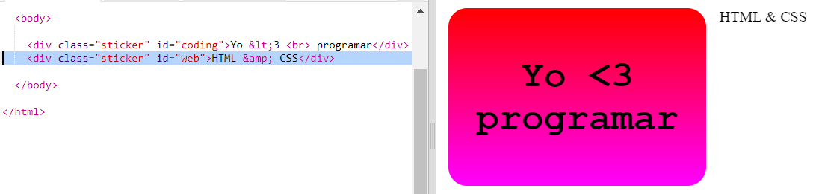
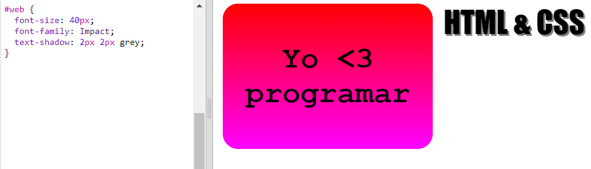
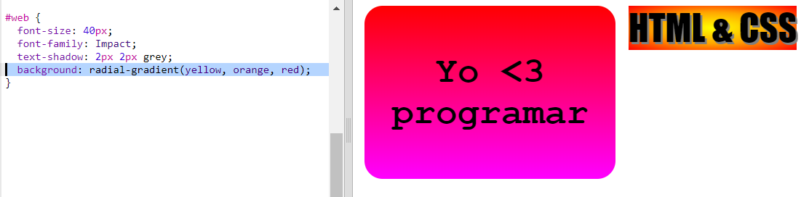
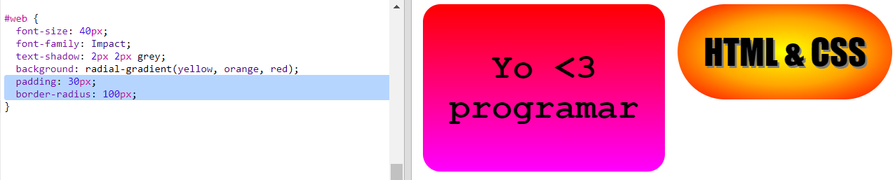

## Sticker HTML y CSS

Los degradados también pueden cambiar de color desde el centro hacia los bordes, esto se denomina degradado radial.

+ Vamos a crear un sticker con el texto `HTML & CSS.` `&` es otro carácter que necesita codificación en HTML, el código es `&amp;`.
    
    Agrega el código resaltado para crear un nuevo sticker:
    
    

+ Ahora abre tu archivo `style.css` y añade un estilo para tu nuevo sticker:
    
    
    
    El código `text-shadow` agrega una sombra que se extiende 2px por debajo y a la derecha del texto para resaltarlo.

+ Ahora el degradado. Esta vez utilizaremos un degradado radial. El color cambiará de amarillo en el centro hasta naranja y luego rojo.
    
    
    
    Ten en cuenta que los degradados pueden incluir varios colores, no solo dos.

+ El sticker se verá mucho mejor con un poco de espacio y un borde redondeado.
    
    Agrega el código resaltado:
    
    