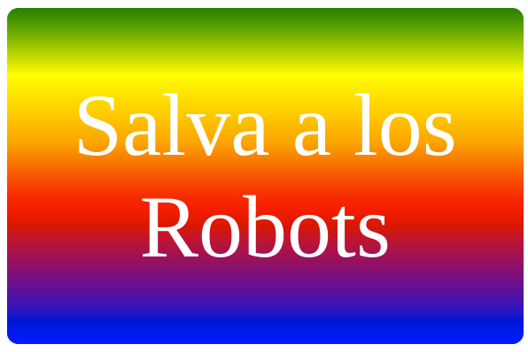

--- challenge ---

## Desafío: Crea tu propio sticker degradado

Ahora haz tu propio sticker degradado. Prueba los degradados lineales y radiales utilizando múltiples colores HTML.

Tendrás que:

+ Agregar un `
` con el texto de tu sticker a `index.html` y aplicarle la clase `sticker` y un nuevo `id` identificador.
+ Añade estilo para el `id` que elegiste en `style.css`. Puedes copiar uno de los estilos del sticker que ya has creado y editarlo. 

Hay una lista de todos los nombres de colores que puedes usar: [jumpto.cc/web-colours](http://jumpto.cc/web-colours), que incluye nombres de colores como `tomato` (tomate), `firebrick` (ladrillo) y `peachpuff` (melocotón).

Si deseas cambiar el color del texto, puede usar `color:`.

Este es un ejemplo de lo que puedes hacer con varios colores en un gradiente lineal:

--- /challenge ---