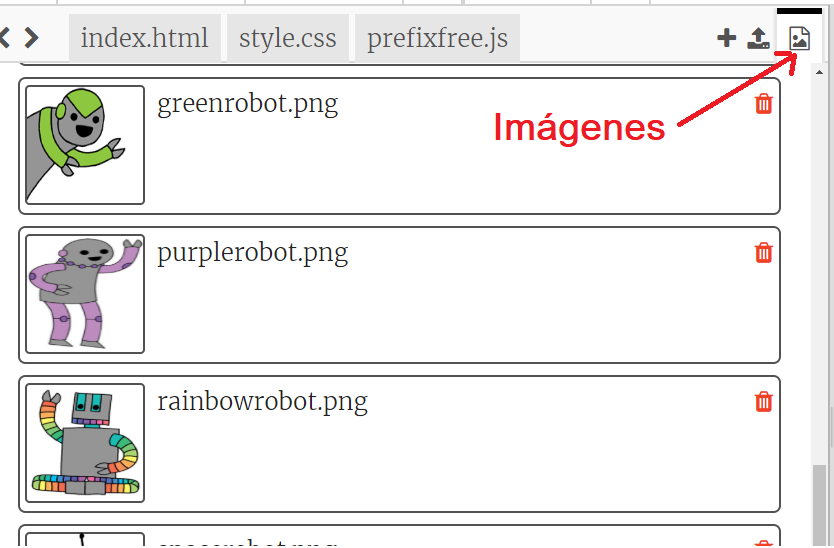
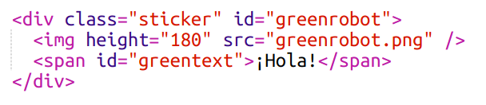
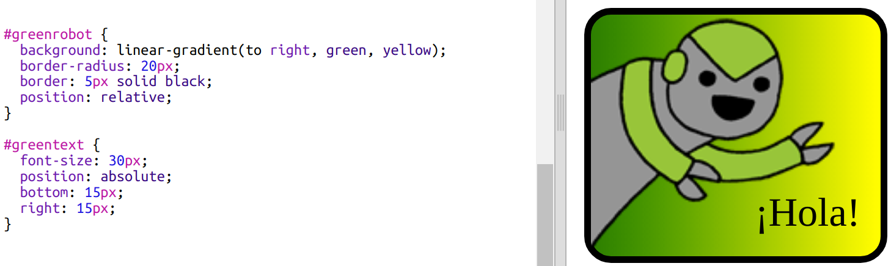

--- challenge ---

## Desafío: Crea más stickers

Ahora intenta crear más stickers usando diferentes direcciones de degradado, agregando imágenes y texto, y utilizando bordes y contornos.

Consejo: Tendrás que agregar HTML y CSS para cada sticker.

Puedes copiar y editar uno de tus ejemplos y hacer cambios para crear un nuevo sticker.

Tu proyecto ya incluye un conjunto de imágenes de robots. Haz clic en el ícono de imágenes para ver las imágenes disponibles.

Este ejemplo utiliza un degradado lineal con `to right` (a la derecha):

--- /challenge ---

***
Este proyecto fue traducido por voluntarios:

Elwin Huaman

Angela de Jesús Meza Echegaray

Gracias a los voluntarios, podemos dar a las personas de todo el mundo la oportunidad de aprender en su propio idioma. Puedes ayudarnos a llegar a más personas ofreciéndote como voluntario para traducir. Más información en [rpf.io/translate](https://rpf.io/translate).