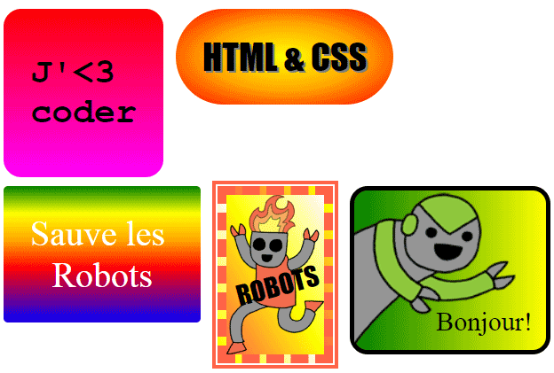

## Introduction

Dans ce projet, tu vas créer de nombreux autocollants amusants que tu pourras utiliser pour décorer des pages Web. Tu apprendras à utiliser des dégradés qui changent progressivement d'une couleur à l'autre pour rendre tes autocollants cool.

### Informations complémentaires pour les responsables de club

Si vous avez besoin d'imprimer ce projet, merci d'utiliser la [Version imprimable](https://projects.raspberrypi.org/en/projects/stickers/print).

## \--- collapse \---

## title: Notes pour le responsable de club

## Introduction:

Dans ce projet, les enfants seront initiés aux dégradés linéaires et radiaux en CSS. Ils en apprendront également davantage sur les bords et le positionnement.

## Ressources en-ligne

Nous recommandons d'utiliser [trinket](https://trinket.io/) pour écrire du HTML & CSS en ligne. Ce projet contient les trinkets suivants:

* [Le point de départ des "Autocollants" -- jumpto.cc/web-stickers](http://jumpto.cc/web-stickers)

Les enfants peuvent également utiliser ce trinket vide [(jumpto.cc/html-blank)](http://jumpto.cc/html-blank) pour écrire leur propre code HTML & CSS, ou utiliser ce trinket modèle [(jumpto.cc/html-template)](http://jumpto.cc/html-template).

Il y a aussi un Trinket contenant un exemple de solution pour les défis :

* ['Autocollants' Terminés -- trinket.io/html/bb4e538e0a](https://trinket.io/html/bb4e538e0a)

## Ressources hors-ligne

This project can be [completed offline](https://rpf.io/html-offline) if preferred. Vous pouvez accéder aux ressources du projet en cliquant sur le lien "Matériel pour projet". Ce lien contient une section "Ressources du projet" qui inclut les ressources dont les enfants auront besoin pour terminer ce projet hors-ligne. Assurez-vous que les enfants ont accès à une copie de ces ressources. Cette section inclut les fichiers suivants:

* intro/index.html
* template/template.html
* template/style.css
* stickers/index.html
* stickers/style.css
* stickers/script.js
* stickers/robot .png images

Vous pouvez aussi trouver une version terminée du projet dans la section "Ressources du bénévole" qui contient:

* stickers-finished/index.html
* stickers-finished/style.css
* stickers-finished/script.js
* stickers-finished/robot .png images

(Toutes les ressources ci-dessus peuvent aussi être téléchargées dans les fichiers `.zip` projet et bénévole)

## Objectifs d'apprentissage

* Ce projet introduit l'utilisation de dégradés CSS pour créer des effets intéressants. Les étudiants approfondiront également leurs connaissances des bordures et du positionnement CSS. 

This project covers elements from the following strands of the [Raspberry Pi Digital Making Curriculum](https://rpf.io/curriculum):

* [Concevoir des éléments de base 2D et 3D](https://www.raspberrypi.org/curriculum/design/creator) .

## Défis

* "Crée ton propre autocollant de dégradé" - ajoute des dégradés linéaires et radiaux au texte;
* "Crée plus d'autocollants!" - Combine des dégradés avec des images et du texte pour créer plus d'autocollants.

\--- /collapse \---

## \--- collapse \---

## title: Matériaux du projet

## Ressources pour le projet

* [Fichier .zip contenant toutes les ressources du projet](https://rpf.io/p/en/stickers-go)
* [Trinket en ligne contenant toutes les ressources du projet 'Intro'](http://jumpto.cc/web-intro)
* [Trinket en ligne contenant toutes les ressources du projet 'Autocollants'](http://jumpto.cc/web-stickers)
* [Modèle de Trinket en ligne](http://jumpto.cc/trinket-template)
* [Trinket en ligne vide](http://jumpto.cc/trinket-blank)
* [template/index.html](resources/template-index.html)
* [template/style.css](resources/template-style.css)
* [stickers/index.html](resources/stickers-index.html)
* [stickers/style.css](resources/stickers-style.css)
* [stickers/prefixfree.js](resources/stickers-prefixfree.js)
* [stickers/bluerobot.png](resources/stickers-bluerobot.png)
* [stickers/firerobot.png](resources/stickers-firerobot.png)
* [stickers/purplerobot.png](resources/stickers-purplerobot.png)
* [stickers/spacerobot.png](resources/stickers-spacerobot.png)
* [stickers/dogrobot.png](resources/stickers-dogrobot.png)
* [stickers/greenrobot.png](resources/stickers-greenrobot.png)
* [stickers/rainbowrobot.png](resources/stickers-rainbowrobot.png)
* [stickers/yellowrobot.png](resources/stickers-yellowrobot.png)

## Ressources pour le responsable de club

* [Fichier .zip contenant toutes les ressources du projet terminé](https://rpf.io/p/en/stickers-go)
* [Projet Trinket en ligne terminé](https://trinket.io/html/bb4e538e0a)
* [stickers-finished/index.html](resources/stickers-finished-index.html)
* [stickers-finished/style.css](resources/stickers-finished-style.css)
* [stickers-finished/prefixfree.js](resources/stickers-finished-prefixfree.js)
* [stickers-finished/bluerobot.png](resources/stickers-finished-bluerobot.png)
* [stickers-finished/firerobot.png](resources/stickers-finished-firerobot.png)
* [stickers-finished/purplerobot.png](resources/stickers-finished-purplerobot.png)
* [stickers-finished/spacerobot.png](resources/stickers-finished-spacerobot.png)
* [stickers-finished/dogrobot.png](resources/stickers-finished-dogrobot.png)
* [stickers-finished/greenrobot.png](resources/stickers-finished-greenrobot.png)
* [stickers-finished/rainbowrobot.png](resources/stickers-finished-rainbowrobot.png)
* [stickers-finished/yellowrobot.png](resources/stickers-finished-yellowrobot.png)

\--- /collapse \---