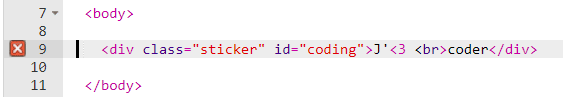
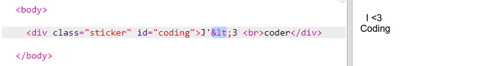
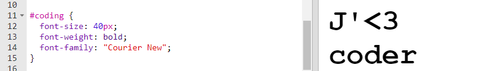
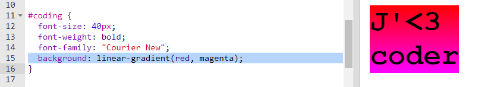
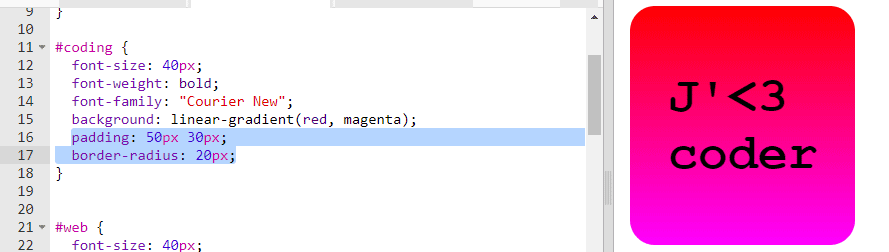

## Autocollant de codage coloré

Un dégradé est un changement progressif d'une couleur à une autre. Les dégradés peuvent être utilisés pour créer des effets sympas. Tu vas les utiliser pour créer des autocollants que tu peux utiliser sur tes pages Web.

+ Ouvre ce trinket: <a href="http://jumpto.cc/web-stickers" target="_blank">jumpto.cc/web-stickers</a>.
    
    Le projet devrait ressembler à ceci:
    
    

+ Faisons un 'J' <3 coderg' sticker.
    
    Utilise une classe `
` avec un `autocollant` et un id `coding` pour que tu puisses le styler:
    
    

+ Hmm as-tu remarqué que tu as une erreur? En effet, '<' est un caractère spécial en HTML. Au lieu de '<', tu dois utiliser le code spécial `&lt;`.
    
    Met à jour ton code pour utiliser `&lt;` de sorte que l'erreur disparaisse.
    
    
    
    ` ` donne une nouvelle ligne.

+ Maintenant, rendons l'autocollant intéressant.
    
    Bascule vers le fichier `style.css`. Tu verras que la classe `.sticker` a été prévue pour toi. Cela permettra de mettre en page des autocollants sur la page et de centrer leur contenu.
    
    Rappels-toi que tu as ajouté l'id `coding` à ton autocollant. Au bas de `style.css` ajoute le code suivant pour styler le texte:
    
    

+ Tu peux maintenant ajouter un dégradé pour l'arrière-plan de l'autocollant. Un dégradé linéaire change d'une couleur à une autre le long d'une ligne droite.
    
    Ce dégradé passera du rouge en haut au magenta en bas. Ajoute le code de dégradé à ton style `coding`:
    
    

+ Tu peux améliorer le résultat en ajoutant du remplissage et des coins arrondis.
    
    Ajoute le code en surbrillance:
    
    
    
    Le style `padding` ajoute un remplissage de 50px en haut et en bas et de 30px à gauche et à droite.