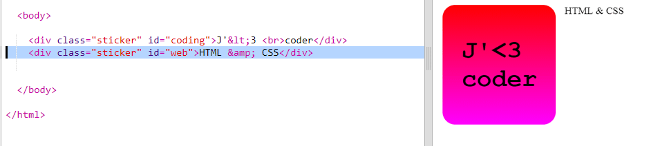
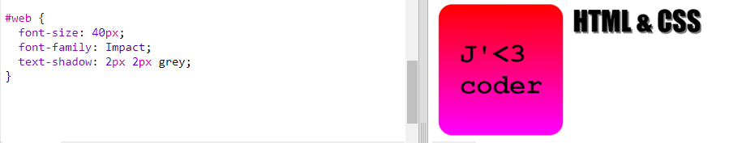
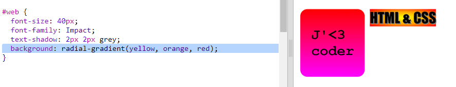
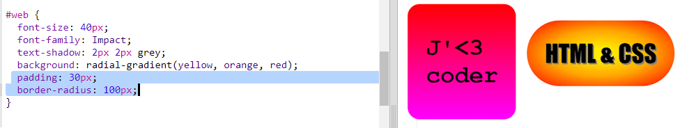

## Autocollant HTML & CSS

Les dégradés peuvent également changer de couleur du centre vers les bords, on appelle cela un dégradé radial.

+ Créons un autocollant avec le texte `HTML & CSS.` `&` est un autre caractère qui nécessite un encodage en HTML, le code est `&amp;`.
    
    Ajoute le code en surbrillance pour créer un nouvel autocollant:
    
    

+ Passe maintenant à ton fichier `style.css` et ajoute un style pour ton nouvel autocollant:
    
    
    
    Le code `text-shadow` ajoute une ombre qui étend 2px ci-dessous et à la droite du texte pour le faire ressortir.

+ Maintenant pour le dégradé. Cette fois, utilisons un dégradé radial. La couleur passera du jaune au centre à l'orange puis au rouge.
    
    
    
    Note que les dégradés peuvent inclure plusieurs couleurs, pas seulement deux.

+ L'autocollant sera beaucoup mieux avec un peu de remplissage et une bordure arrondie.
    
    Ajoute le code en surbrillance:
    
    