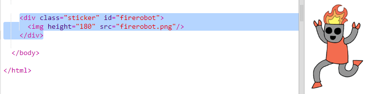
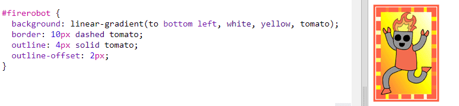
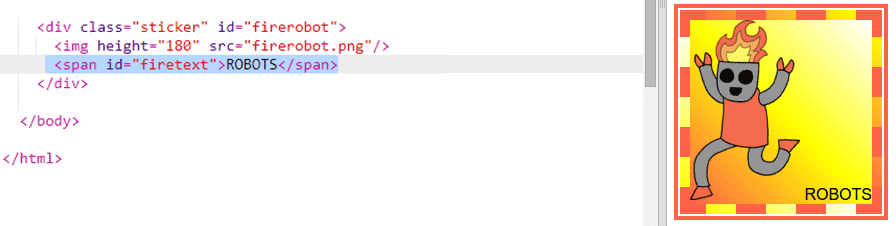
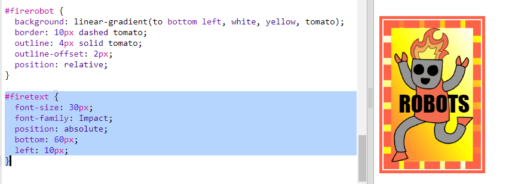
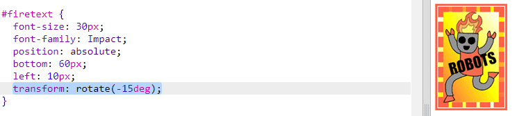

## Autocollant robot fantaisiste

Tu peux créer un autocollant dégradé à l'aide d'une image. Si tu utilises une image avec un arrière-plan transparent alors le dégradé sera visible.

Tu peux également créer des dégradés à exécuter dans différentes directions.

+ Ajoute un autocollant à `index.html` en utilisant l'image `firerobot.png`:
    
    
    
    Tu peux ajuster le `hauteur` pour redimensionner l'image, la largeur changera automatiquement.

+ Normalement, un dégradé linéaire va du haut vers le bas, mais tu peux utiliser `to` pour changer de direction. Par exemple: `to top` , `to left` ou `to right`.
    
    Pour un gradient en diagonale, tu donnes deux directions. Cet exemple utilise `to bottom left`.
    
    Ajoute ce style à `style.css` pour donner à ton nouvel autocollant robot un dégradé diagonal et une bordure fantaisie:
    
    
    
    Note que tu peux utiliser `outline` pour créer un autre bord en dehors de l'habituel. `outline-offset` donne l'écart entre la bordure et le contour.

+ Ajoutons du texte à cet autocollant.
    
    Ajoute un ``contenant le texte "ROBOTS" à `index.html` et donne lui un id.
    
    

+ Le texte paraîtra mieux si tu le fais plus grand et le positionne.
    
    Pour positionner le texte, tu dois ajouter `position: relative;` à `#greensticker` et `position: absolute` à `#greentext`. Le positionnement est traité plus en détail dans le projet `Construire un robot`.
    
    Ajoute ce qui suit au fichier `style.css`:
    
    

+ Et pour une dernière rotation, fais pivoter le texte en utilisant `transform: rotate`.
    
    
    
    Essaie de changer le nombre de degrés de rotation du texte.