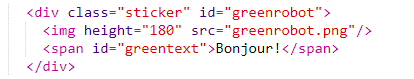
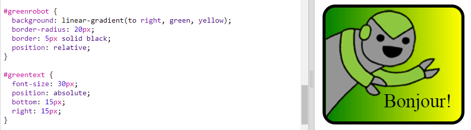

\--- challenge \---

## Défi : Faire plus d'autocollants

Essaie maintenant de créer plus d'autocollants en utilisant différentes directions de dégradé, en ajoutant des images et du texte et en utilisant des bordures et des contours.

Conseil: Tu devras ajouter HTML et CSS pour chaque autocollant.

Tu peux copier et modifier l'un de tes exemples et apporter des modifications pour créer un nouvel autocollant.

Ton projet comprend déjà un ensemble d'images de robot. Clique sur l'icône des images pour voir les images disponibles.

Cet exemple utilise un dégradé linéaire avec `to right` :

\--- /challenge \---