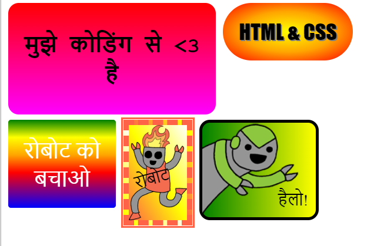

## भूमिका

इस प्रोजेक्ट में, आप कई मज़ेदार स्टिकर बनाएँगे, जिनका आप वेबपेजों की सजावट के लिए उपयोग कर सकते हैं। आप ग्रेडिएंटस उपयोग करना सीखेंगे जिनका रंग स्टिकर को दिखने में बढ़िया बनाने के लिए एक रंग से दूसरे में धीरे-धीरे परिवर्तित होता है। 

### क्लब लीडर्स के लिए अतिरिक्त जानकारी

यदि आप इस प्रोजेक्ट को प्रिंट करना चाहते हैं, तो कृपया [प्रिंटर के लिए अनुकूल संस्करण](https://projects.raspberrypi.org/en/projects/stickers/print) का उपयोग करें।

--- collapse ---
---
title: क्लब लीडर के नोट्स
---

## भूमिका:
इस प्रोजेक्ट में, बच्चों को CSS में लीनियर और रेडियल ग्रेडिएंटस से परिचित करवाया जाएगा। वे बॉर्डर और स्थिति के बारे में भी और अधिक जानेंगे। 

## ऑनलाइन संसाधन

HTML और CSS को ऑनलाइन लिखने के लिए हम [trinket](https://trinket.io/) का उपयोग करने की अनुशंसा करते हैं। इस प्रोजेक्ट में निम्नलिखित ट्रिंकेट शामिल होते हैं:

+ ['सूर्योदय' का आरंभ बिंदु -- jumpto.cc/web-sunrise](http://jumpto.cc/web-sunrise)

बच्चे स्वयं का HTML और CSS लिखने के लिए इस [(jumpto.cc/html-blank)](http://jumpto.cc/html-blank) खाली ट्रिंकेट का भी उपयोग कर सकते हैं, या वैकल्पिक तौर पर वे इस टैंपलेट ट्रिंकेट का उपयोग कर सकते हैं [(jumpto.cc/html-template)](http://jumpto.cc/html-template)।

ऐसा ट्रिंकेट भी होता है, जिसमें चुनौतियों के लिए हल का नमूना शामिल होता है:

+ ['स्टिकर्स' पूर्ण -- trinket.io/html/bb4e538e0a](https://trinket.io/html/bb4e538e0a)

## ऑफ़लाइन संसाधन
यदि चाहें तो इस प्रोजेक्ट को [ऑफ़लाइन पूरा किया जा सकता है](https://www.codeclubprojects.org/en-GB/resources/webdev-working-offline/)। आप इस प्रोजेक्ट के लिए 'प्रोजेक्ट सामग्री' लिंक पर क्लिक करके प्रोजेक्ट के संसाधनों का उपयोग कर सकते हैं। इस लिंक में 'प्रोजेक्ट संसाधन' भाग शामिल है, जिसमें ऐसे स्रोत शामिल हैं जिनकी आवश्यकता बच्चों को अपने प्रोजेक्ट ऑफ़लाइन पूरा करने के लिए हो सकती है। सुनिश्चित करें कि प्रत्येक बच्चे की इन संसाधनों तक पहुँच है। इस भाग में निम्नलिखित फाइलें शामिल हैं:

+ intro/index.html
+ template/template.html
+ template/style.css
+ stickers/index.html
+ stickers/style.css
+ stickers/script.js
+ stickers/robot .png images

आप इस प्रोजेक्ट की चुनौतियों का पूर्ण संस्करण 'स्वैच्छिक संसाधन' भाग में भी देख सकते हैं, जिसमें ये शामिल हैं:

+ stickers-finished/index.html
+ stickers-finished/style.css
+ stickers-finished/script.js
+ stickers-finished/robot .png images

(उपर्युक्त सभी स्रोत प्रोजेक्ट और स्वैच्छिक `.zip` फाइलों के रूप में डाउनलोड योग्य हो सकते हैं।)

## अधिगम उद्देश्य
+ दिलचस्प प्रभाव बनाने के लिए, यह प्रोजेक्ट CSS ग्रेडिएंटस का परिचय देता है। बच्चे CSS के बॉर्डर और स्थिति के बारे में अपना ज्ञान बढ़ाएँगे। 

इस प्रोजेक्ट में [Raspberry Pi डिजिटल निर्माण पाठ्यचर्या](http://rpf.io/curriculum) के निम्नलिखित गुणों के तत्व शामिल हैं:

+ [आधारभूत 2D और 3D संपदाएँ डिज़ाइन करें](https://www.raspberrypi.org/curriculum/design/creator).

## चुनौतियाँ
+ "अपना स्वयं का ग्रेडिएंट स्टिकर बनाएँ" – टेक्स्ट में लीनियर और रेडियल ग्रेडिएंट जोड़कर;
+ "और स्टिकर बनाएँ!" - और स्टिकर बनाने के लिए ग्रेडिएंटस को छवियों और टेक्स्ट के साथ जोड़ें।

--- /collapse ---

--- collapse ---
---
title: प्रोजेक्ट सामग्री
---
## प्रोजेक्ट संसाधन
* [सभी प्रोजेक्ट स्रोतों सहित .zip फाइल](resources/stickers-project-resources.zip)
* [सभी 'भूमिका' प्रोजेक्ट संसाधनों सहित ऑनलाइन ट्रिंकेट](http://jumpto.cc/web-intro)
* [सभी 'स्टिकर्स' प्रोजेक्ट संसाधनों सहित ऑनलाइन ट्रिंकेट](http://jumpto.cc/web-stickers)
* [ऑनलाइन ट्रिंकेट टेम्प्लेट](http://jumpto.cc/trinket-template)
* [ऑनलाइन खाली ट्रिंकेट](http://jumpto.cc/trinket-blank)
* [template/index.html](resources/template-index.html)
* [template/style.css](resources/template-style.css)
* [stickers/index.html](resources/stickers-index.html)
* [stickers/style.css](resources/stickers-style.css)
* [stickers/prefixfree.js](resources/stickers-prefixfree.js)
* [stickers/bluerobot.png](resources/stickers-bluerobot.png)
* [stickers/firerobot.png](resources/stickers-firerobot.png)
* [stickers/purplerobot.png](resources/stickers-purplerobot.png)
* [stickers/spacerobot.png](resources/stickers-spacerobot.png)
* [stickers/dogrobot.png](resources/stickers-dogrobot.png)
* [stickers/greenrobot.png](resources/stickers-greenrobot.png)
* [stickers/rainbowrobot.png](resources/stickers-rainbowrobot.png)
* [stickers/yellowrobot.png](resources/stickers-yellowrobot.png)

## क्लब लीडर के संसाधन
* [सभी पूर्ण प्रोजेक्ट स्रोतों सहित .zip फाइल](resources/stickers-volunteer-resources.zip)
* [ऑनलाइन पूर्ण ट्रिंकेट प्रोजेक्ट](https://trinket.io/html/bb4e538e0a)
* [stickers-finished/index.html](resources/stickers-finished-index.html)
* [stickers-finished/style.css](resources/stickers-finished-style.css)
* [stickers-finished/prefixfree.js](resources/stickers-finished-prefixfree.js)
* [stickers-finished/bluerobot.png](resources/stickers-finished-bluerobot.png)
* [stickers-finished/firerobot.png](resources/stickers-finished-firerobot.png)
* [stickers-finished/purplerobot.png](resources/stickers-finished-purplerobot.png)
* [stickers-finished/spacerobot.png](resources/stickers-finished-spacerobot.png)
* [stickers-finished/dogrobot.png](resources/stickers-finished-dogrobot.png)
* [stickers-finished/greenrobot.png](resources/stickers-finished-greenrobot.png)
* [stickers-finished/rainbowrobot.png](resources/stickers-finished-rainbowrobot.png)
* [stickers-finished/yellowrobot.png](resources/stickers-finished-yellowrobot.png)

--- /collapse ---