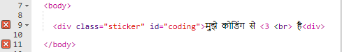
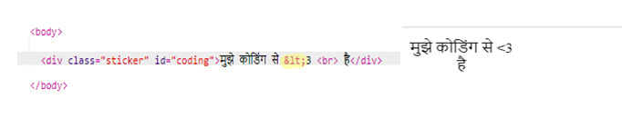
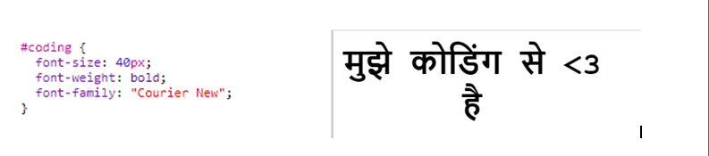
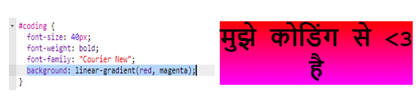
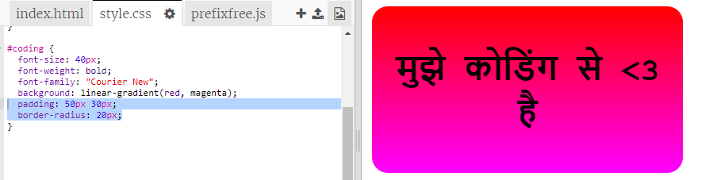

## रंगीन कोडिंग स्टिकर

ग्रेडिएंट एक रंग से दूसरे रंग में क्रमिक बदलाव होता है। ग्रेडिएंट का उपयोग मज़ेदार प्रभाव बनाने के लिए किया जा सकता है। आप उनका उपयोग वे स्टिकर बनाने के लिए करेंगे, जिनका आप अपने वेबपेजों पर उपयोग कर सकते हैं। 

+ इस ट्रिंकेट को खोलें: <a href="http://jumpto.cc/web-stickers" target="_blank">jumpto.cc/web-stickers</a>. 

	इस प्रोजेक्ट को ऐसा दिखना चाहिए:

	

+ चलिए 'I <3 Coding' स्टिकर बनाएँ। 

	`sticker` क्लास के साथ `
` और `coding` id का उपयोग करें, ताकि आप इसे स्टाइल दे सकें: 

	

+ हम्म क्या आपने ध्यान दिया कि आपकेने त्रुटि की है? ऐसा इसलिए है क्योंकि '<' HTML में विशेष कैरेक्टर है। '<' के बजाय आपको विशेष कोड `&lt;` का उपयोग करना होगा। 

	`&lt;` का उपयोग करने के लिए अपने कोड को अपडेट करें, ताकि त्रुटि दूर हो जाए। 

	

	` ` नई पंक्ति प्रदान करता है। 

+ चलिए अब स्टिकर को और भी दिलचस्प बनाएँ। 

	`style.css` फाइल पर स्विच करें। आप देखेंगे कि आपके लिए `.sticker` क्लास प्रदान की गई है। यह स्टिकर्स को पेज पर लेआउट करेगा और उनकी सामग्री को बीच में लाएगा। 

	याद रखें कि आपने अपने स्टिकर में id `coding` जोड़ी है। टेक्स्ट को स्टाइल देने के लिए `style.css` के नीचे निम्नलिखित कोड जोड़ें:

	

+ अब आप स्टिकर की पृष्ठभूमि के लिए ग्रेडिएंट जोड़ सकते हैं। लीनियर ग्रेडिएंट सीधी रेखा में एक रंग से दूसरे में परिवर्तित होता है।

	यह ग्रेडिएंट शीर्ष पर लाल से नीचे की ओर मजेंटा में परिवर्तित होगा। अपने `coding` स्टाइल में ग्रेडिएंट जोड़ें:

	

+ आप पैडिंग और गोलाकार कोने जोड़कर परिणाम में सुधार कर सकते हैं। 

	हाइलाइट किया गया कोड जोड़ें:

	

	`padding` स्टाइल उपर और नीचे 50px और बाईं ओर तथा दाईं ओर 30px की पैडिंग जोड़ता है। 

