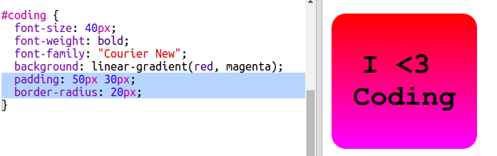

## रंगीन कोडिंग स्टिकर

ग्रेडिएंट एक रंग से दूसरे रंग में एक क्रमिक परिवर्तन होता है। ग्रेडिएंट सुन्दर इफेक्ट्स बनाने के लिए इस्तेमाल किया जा सकता है। उनसे आप स्टिकर बनाएँगे जिन्हे आप जिनका उपयोग आप अपने वेब पृष्ठो पर कर सकते हैं।

+ इस trinket को खोलें: <a href="http://jumpto.cc/web-stickers" target="_blank"> jumpto.cc/web-stickers </a> ।
    
    प्रोजेक्ट इस तरह दिखना चाहिए:
    
    

+ चलो एक 'I <3 Coding' स्टिकर बनाते हैंg' sticker.
    
    `sticker` क्लास के साथ `
` का उपयोग करें और `coding` id ताकि आप इसे स्टाइल कर सकें:
    
    

+ हम्म... आपने देखा कि आपको कोई एरर मिला? ऐसा इसलिए है क्योंकि HTML में '<' एक विशेष चरित्र है। '<' के बजाय आपको इस विशेष कोड का उपयोग करने की आवश्यकता है `&lt; ` 
    
    `&lt` का उपयोग करने के लिए अपने कोड को अपडेट करें; ताकि एरर दूर हो जाए।
    
    
    
    ` ` एक नई लाइन देता है।

+ अब स्टिकर को दिलचस्प बनाते हैं।
    
    `style.css` पर फ़ाइल स्विच करें। आप देखेंगे कि `.sticker ` क्लास आपके लिए प्रदान की गई है। यह पेज परस्टिकर दिखाएगा और उनको केंद्र में रखेगा।
    
    याद रखें कि आपने id `coding`अपने स्टीकर में जोड़ा है। `style.css` के निचले भाग में टेक्स्ट को स्टाइल करने के लिए निम्न कोड जोड़ें:
    
    

+ अब आप स्टिकर के बैकग्राउंड में एक ग्रेडिएंट लगा सकते हैं। एक रेखीय ग्रेडिएंट एक रंग से दूसरे में सीधी रेखा के साथ बदलता है।
    
    यह ग्रेडिएंट नीचे से ऊपर की ओर लाल रंग से मैजेंटा में बदल जाएगा। अपने `coding` स्टाइल में ग्रेडिएंट कोड जोड़ें:
    
    

+ आप पैडिंग और गोल कोनों को जोड़कर परिणाम में सुधार कर सकते हैं।
    
    हाइलाइट किए गए कोड को जोड़ें:
    
    
    
    `padding` स्टाइल ऊपर और नीचे 50px की पैडिंग और बाईं और दाईं ओर 30px जोड़ता है।