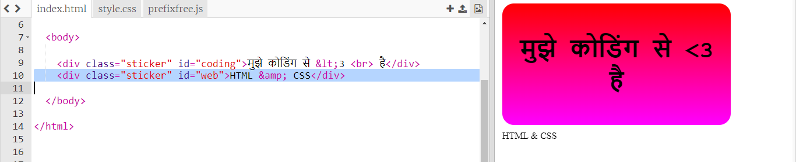
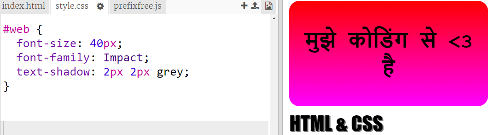
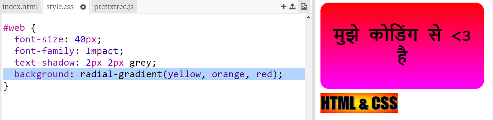
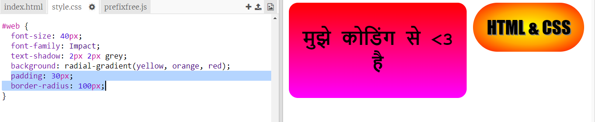

## HTML और CSS स्टिकर

ग्रेडिएंट केंद्र से किनारों की ओर भी रंग बदल सकते हैं, इसे रेडियल ग्रेडिएंट कहा जाता है।

+ एक स्टिकर बनाते है ` HTML & CSS` के साथ । `&` एक अन्य वर्ण है जिसकी HTML में एन्कोडिंग की आवश्यकता है, कोड है `&amp; ` ।
    
    नया स्टिकर बनाने के लिए हाइलाइट किया गया कोड जोड़ें:
    
    

+ अब अपने `style.css` फ़ाइल पर स्विच करें और अपने नए स्टिकर के लिए एक स्टाइल जोड़ें:
    
    
    
    `text-shadow` कोड एक छाया जोड़ता है जो टेक्स्ट के 2px नीचे और दाईं ओर तक फैली है ताकि वो अलग से दिखाई दे सके ।

+ अब ग्रेडिएंट की बात करते है । इस बार चलो एक रेडियल ग्रेडिएंट का उपयोग करें। केंद्र में पीले से नारंगी और फिर लाल रंग में बदला जाएगा।
    
    
    
    ध्यान दें कि ग्रेडिएंट में दो ही नहीं, कई रंग शामिल हो सकते हैं।

+ स्टिकर थोड़ी पैडिंग और एक गोल सीमा के साथ बहुत बेहतर लगेगा।
    
    हाइलाइट किए गए कोड को जोड़ें:
    
    