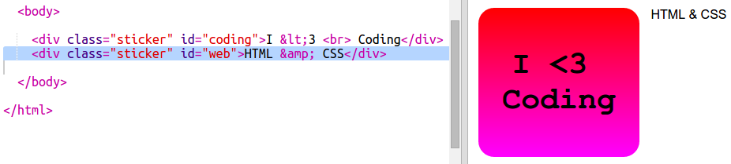
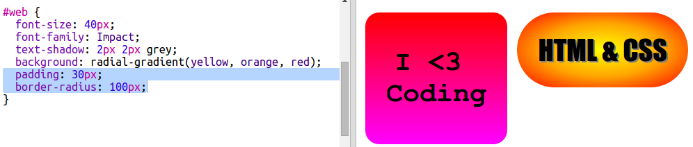

## HTML और CSS स्टिकर

ग्रेडिएंट का रंग केंद्र से बाहर किनारे की ओर भी बदल सकता है, इसे रेडियल ग्रेडिएंट कहते हैं। 

+ चलिए `HTML & CSS.` टेक्स्ट के साथ स्टिकर बनाएँ `&` अन्य कैरेक्टर है, जिसके लिए HTML में कोड करना आवश्यक होता है, कोड `&amp;` है।

	नया स्टिकर बनाने के लिए हाइलाइट किया गया कोड जोड़ें: 

	

+ अब अपनी `style.css` फाइल में स्विच करें और अपने नए स्टिकर के लिए स्टाइल जोड़ें:

	

	`text-shadow` कोड छाया जोड़ता है, जो टेक्स्ट को अलग दिखाने के लिए 2px नीचे की ओर तथा टेक्स्ट के दाईं ओर फ़ैल जाती है। 

+ अब ग्रेडिएंट के लिए। चलिए इस बार रेडियल ग्रेडिएंट का उपयोग करें। इसका रंग केंद्र में पीला और फिर बाहर की ओर नारंगी और फिर लाल हो जाएगा। 

	

	ध्यान दें कि ग्रेडिएंट में केवल दो नहीं, बल्कि कई रंग शामिल हो सकते हैं। 

+ स्टिकर कुछ पैडिंग और गोलाकार बॉर्डर के साथ बहु बेहतर दिखाई देगा। 

	हाइलाइट किया गया कोड जोड़ें:

	

