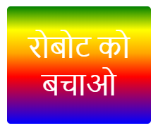

--- challenge ---
## चुनौती: अपना स्वयं का ग्रेडिएंट स्टिकर बनाएँ

अब अपना स्वयं का ग्रेडिएंट स्टिकर बनाएँ। कई HTML रंगों का उपयोग करके लीनियर और रेडियल ग्रेडिएंट बनाने का प्रयास करें। 

आपको यह करना होगा:

+ `index.html` पर अपने स्टिकर के टेक्स्ट में `
` जोड़ें और इसे `sticker` क्लास और नई `id` दें।
+ `style.css` में अपनी चयनित `id` के लिए स्टाइल जोड़ें। आप अपने द्वारा पहले बनाए जा चुके स्टिकर को कॉपी कर सकते हैं, और उसे संपादित कर सकते हैं। 

आपके लिए उपयोग करने के लिए, सभी रंगों की सूची है: [jumpto.cc/web-colours](http://jumpto.cc/web-colours), जिसमें `tomato`, `firebrick` और `peachpuff` जैसे रंगों के नाम शामिल हैं।

यदि आप टेक्स्ट का रंग बदलना चाहते हैं, तो आप `color:` उपयोग कर सकते हैं।

आप लीनियर ग्रेडिएंट में विभिन्न रंगों के साथ क्या कर सकते हैं, इसका उदाहरण इस प्रकार है:

--- /challenge ---