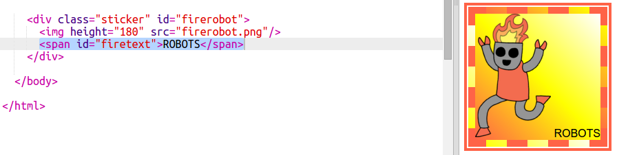

## फैंसी रोबोट स्टिकर

आप एक छवि का उपयोग करके एक ग्रेडिएंट स्टिकर बना सकते हैं। यदि आप एक पारदर्शी पृष्ठभूमि के साथ एक छवि का उपयोग करते हैं तो ग्रेडिएंट दिखाई देगा।

आप विभिन्न दिशाओं में चलने वाला ग्रेडिएंट भी बना सकते हैं।

+ `firerobot.png` छवि का उपयोग करते हुए `index.html` में एक स्टिकर लगाएं:
    
    
    
    आप `height` से छवि का आकार समायोजित कर सकते हैं, चौड़ाई अपने आप बदल जाएगी।

+ आम तौर पर एक रैखिक ग्रेडिएंट ऊपर से नीचे तक चलती है, लेकिन आप `to` का उपयोग कर दिशा बदल सकते हैं । उदाहरण के लिए: `to top` , `to left` या `to right` ।
    
    एक विकर्ण ग्रेडिएंट के लिए आप दो दिशाएं देते हैं। यह उदाहरण `to bottom left ` का उपयोग करता है।
    
    इस स्टाइल को `style.css`में लगाकर अपने नए रोबोट स्टिकर को विकर्ण ग्रेडिएंट और फैंसी बॉर्डर दें:
    
    
    
    ध्यान दें कि आप `outline` सामान्य सीमा के बाहर एक और सीमा बनाने के लिए उपयोग कर सकते हैं। `outline-offset` सीमा और रूपरेखा के बीच अंतर देता है।

+ आइए इस स्टिकर में कुछ टेक्स्ट जोड़ें।
    
    `index.html` में एक `` लगाएं जिसमे टेक्स्ट "ROBOTS" हो और उसे एक id दें।
    
    

+ यदि आप इसे बड़ा बनाते हैं और स्तिथ करते हैं तो टेक्स्ट बेहतर दिखेगा।
    
    टेक्स्ट को स्तिथ करने के लिए आपको `position: relative;` को `#greensticker` से और `position: absolute` को `#greentext` से जोड़ने की आवश्यकता होगी। पोजिशनिंग के बारे में विस्तार से ` एक रोबोट का निर्माण करें` प्रोजेक्ट में जानेंगे ।
    
    निम्नलिखित शैली को `style.css` में जोड़ें |
    
    

+ और अब अंत में, टेक्स्ट को `transform: rotate`का उपयोग करके घुमाएँ।
    
    
    
    टेक्स्ट को घुमाए जाने वाले डिग्री की संख्या को बदलने का प्रयास करें।