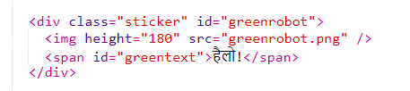
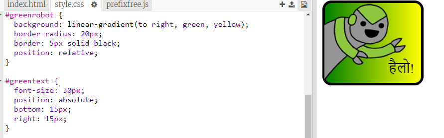

--- challenge ---
## चुनौती: और स्टिकर बनाएँ

अब विभिन्न ग्रेडिएंट दिशाओं और छवियाँ और टेक्स्ट जोड़कर और बॉर्डर और आउटलाइन्स का उपयोग करके, और स्टिकर बनाने का प्रयास करें। 

युक्ति: आपके प्रत्येक स्टिकर के लिए HTML और CSS जोड़ने की आवश्यकता होगी। 

आप किसी उदाहरण को कॉपी और संपादित कर सकते हैं और नया स्टिकर बनाने के लिए परिवर्तन कर सकते हैं। 

आपके प्रोजेक्ट में पहले से ही रोबोट की छवियाँ शामिल हैं। उपलब्ध छवियाँ देखने के लिए images आइकन पर क्लिक करें। 

यह उदाहरण `to right` के साथ लीनियर ग्रेडिएंट का उपयोग करता है:

--- /challenge ---