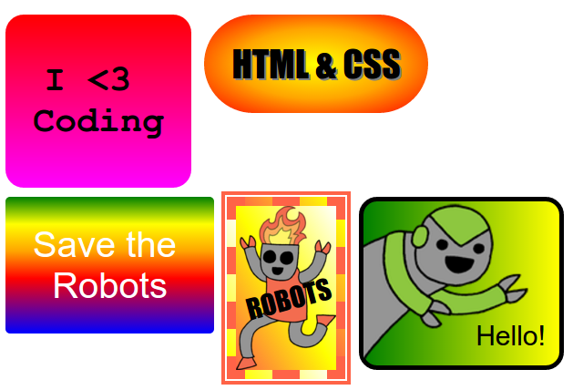

## Uvod

U ovom projektu stvorit ćete mnogo zabavnih naljepnica koje možete upotrijebiti za ukrašavanje web stranica. Naučit ćete o upotrebi gradijenta koji se postupno mijenjaju s jedne boje na drugu da bi vaše naljepnice bile sjajne.

### Dodatne informacije za voditelje kluba

Ako želite ispisati ovaj projekt, molimo Vas da koristite [verziju koja je prilagođena za ispis](https://projects.raspberrypi.org/en/projects/stickers/print).

## \--- collapse \---

## title: Bilješke za voditelja kluba

## Uvod:

U ovom projektu, djeca će se upoznati s linearnim i radijalnim gradijentima u CSS-u. Također će saznati više o granicama i pozicioniranju.

## Online izvori

Preporučujemo korištenje [trinket](https://trinket.io/) pisati HTML & amp; CSS online. Ovaj projekt sadrži sljedeće stvari:

* ['Stickers' starting point -- jumpto.cc/web-stickers](http://jumpto.cc/web-stickers)

Djeca također mogu koristiti ovu praznu trinket [(jumpto.cc/html-blank)](http://jumpto.cc/html-blank) napisati vlastiti HTML & CSS ili alternativno mogu upotrijebiti ovaj predložak trinket [(jumpto.cc/html-template)](http://jumpto.cc/html-template).

Također je uključen i trinket koji sadrži prijedlog rješenja izazova:

* ['Naljepnice' su gotovi - trinket.io/html/bb4e538e0a](https://trinket.io/html/bb4e538e0a)

## Offline izvori

Ako želite, ovaj projekt može bit [završen offline](https://www.codeclubprojects.org/en-GB/resources/webdev-working-offline/). Materijalima projekta možete pristupiti klikom na poveznicu 'Project Materials'. Poveznica sadrži odjeljak 'Resursi projekta' u kojem se nalaze materijali koji će djeci biti potrebni za izradu projekta offline. Pobrinite se da svako dijete ima pristup kopiji ovih materijala. U odjeljku se nalaze sljedeće datoteke:

* Uvod / index.html
* template/template.html
* template/style.css
* naljepnice / index.html
* naljepnice / style.css
* naljepnice / script.js
* naljepnice / robota .png slike

Dovršene verzije izazova projekta možete pronaći i u odjeljku 'Resursi za volontere' koji sadrži:

* naljepnice-gotov / index.html
* naljepnice-gotov / style.css
* naljepnice-gotovi / script.js
* slike s naljepnicama / robota .png

(Svi spomenuti materijali nalaze se u materijalima projekta i materijalima za volontere, moguće je preuzeti kao `.zip` datoteke.)

## Ishodi učenja

* Ovaj projekt uvodi uporabu CSS gradijenata kako bi stvorili zanimljive učinke. Studenti će također proširiti svoje znanje o CSS granicama i pozicioniranju. 

Ovaj projekt pokriva elemente sljedećih dijelova kurikuluma [Raspberry Pi Digital Making Curriculum](http://rpf.io/curriculum):

* [Dizajnirajte osnovna 2D i 3D sredstva](https://www.raspberrypi.org/curriculum/design/creator).

## Izazovi

* "Stvorite svoju naljepnicu gradijenta" - dodavanje linearnih i radijalnih gradijenata u tekst;
* "Napravite više naljepnica!" - Kombinirajte gradijente sa slikama i tekstom kako biste stvorili više naljepnica.

\--- /collapse \---

## \--- collapse \---

## title: Materijali projekta

## Resursi projekta

* [.zip datoteka koja sadrži sve materijale projekta](resources/stickers-project-resources.zip)
* [Online Trinket koji sadrži sve resurse projekta 'Intro'](http://jumpto.cc/web-intro)
* [Online Trinket koji sadrži sve resurse projekta "Naljepnice"](http://jumpto.cc/web-stickers)
* [Online Trinket predložak](http://jumpto.cc/trinket-template)
* [Online prazan Trinket](http://jumpto.cc/trinket-blank)
* [template/index.html](resources/template-index.html)
* [template/style.css](resources/template-style.css)
* [naljepnice / index.html](resources/stickers-index.html)
* [naljepnice / style.css](resources/stickers-style.css)
* [naljepnice / prefixfree.js](resources/stickers-prefixfree.js)
* [naljepnice / bluerobot.png](resources/stickers-bluerobot.png)
* [naljepnice / firerobot.png](resources/stickers-firerobot.png)
* [naljepnice / purplerobot.png](resources/stickers-purplerobot.png)
* [naljepnice / spacerobot.png](resources/stickers-spacerobot.png)
* [naljepnice / dogrobot.png](resources/stickers-dogrobot.png)
* [naljepnice / greenrobot.png](resources/stickers-greenrobot.png)
* [naljepnice / rainbowrobot.png](resources/stickers-rainbowrobot.png)
* [naljepnice / yellowrobot.png](resources/stickers-yellowrobot.png)

## Resursi voditelja kluba

* [.zip datoteka koja sadrži sve dovršene resurse projekta](resources/stickers-volunteer-resources.zip)
* [Dovršeni Online Trinket projekt](https://trinket.io/html/bb4e538e0a)
* [naljepnice-gotov / index.html](resources/stickers-finished-index.html)
* [naljepnice-gotov / style.css](resources/stickers-finished-style.css)
* [naljepnice-gotovi / prefixfree.js](resources/stickers-finished-prefixfree.js)
* [naljepnice-gotov / bluerobot.png](resources/stickers-finished-bluerobot.png)
* [naljepnice-gotov / firerobot.png](resources/stickers-finished-firerobot.png)
* [naljepnice-gotov / purplerobot.png](resources/stickers-finished-purplerobot.png)
* [naljepnice-gotov / spacerobot.png](resources/stickers-finished-spacerobot.png)
* [naljepnice-gotov / dogrobot.png](resources/stickers-finished-dogrobot.png)
* [naljepnice-gotov / greenrobot.png](resources/stickers-finished-greenrobot.png)
* [naljepnice-gotov / rainbowrobot.png](resources/stickers-finished-rainbowrobot.png)
* [naljepnice-gotov / yellowrobot.png](resources/stickers-finished-yellowrobot.png)

\--- /collapse \---