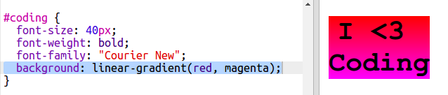
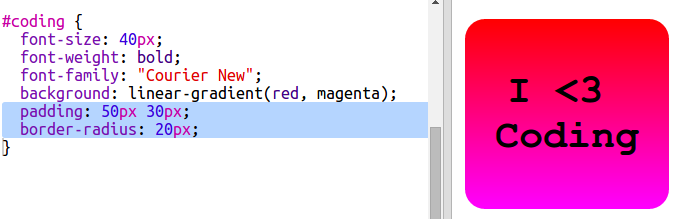

## Naljepnica sa šarenim kodiranjem

Gradijent je postupna promjena iz jedne boje u drugu. Gradijenti se mogu koristiti za stvaranje hladnih efekata. Koristit ćete ih za stvaranje naljepnica koje možete koristiti na svojim web stranicama.

+ Otvori ovaj trinket: <a href="http://jumpto.cc/web-stickers" target="_blank">jumpto.cc/web-stickers</a>.
    
    Projekt bi trebao izgledati ovako:
    
    

+ Napravimo 'I <3 Coding' sticker.
    
    Koristite `
` s `naljepnicom` klasa i</code> kodom `kako biste ga mogli oblikovati:

</li>
<li>
Jeste li primijetili da ste imali pogrešku? To je zato što je "<" posebni znak u HTML-u. Umjesto "<" morate koristiti posebni kod <code>&lt;`.
    
    Ažurirajte kôd da biste koristili `&lt;` tako da pogreška nestane.
    
    
    
    ` ` daje novu liniju.

+ Sada neka nova naljepnica izgleda zanimljivo.
    
    Prijeđite na `style.css` datoteku. Vidjet ćete da vam `.sticker` klasa postoji. To će postaviti naljepnice na stranici i centrirati njihov sadržaj.
    
    Imajte na umu da ste dodali ID `kodiranje` na svoju naljepnicu. Pri dnu `style.css` dodajte sljedeći kod za stiliranje teksta:
    
    

+ Sada možete dodati gradijent za pozadinu naljepnice. Linearni gradijent mijenja se s jedne boje na drugu uzduž ravne linije.
    
    Ovaj gradijent će se promijeniti od crvene na vrhu do magenta na dnu. Dodajte kôd gradijenta na `kodni` stil:
    
    

+ Na rezultat možete poboljšati dodavanjem paddinga i zaobljenih uglova.
    
    Dodaj označeni kôd:
    
    
    
    `padding` stil dodaje padding od 50px na vrhu i dnu i 30px s lijeve i desne strane.