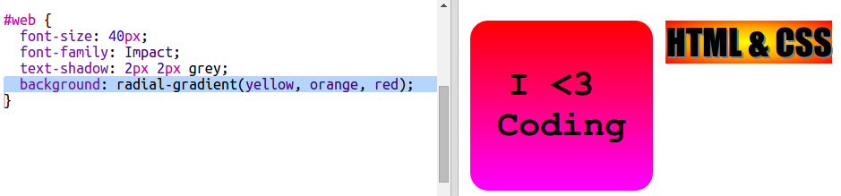

## HTML & CSS sticker

Gradients can also change colour from the centre out towards the edges, this is called a radial gradient.

+ Let's create a sticker with the text `HTML & CSS.` `&` is another character that needs encoding in HTML, the code is `&amp;`.
    
    Add the highlighted code to create a new sticker:
    
    

+ Now switch to your `style.css` file and add a style for your new sticker:
    
    
    
    The `text-shadow` code adds a shadow which extends 2px below and to the right of the text to make it stand out.

+ Now for the gradient. This time let's use a radial gradient. The colour will change from yellow in the centre through to orange and then red.
    
    
    
    Notice that gradients can include multiple colours, not just two.

+ The sticker will look much better with some padding and a rounded border.
    
    Add the highlighted code:
    
    