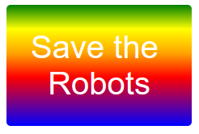

\--- izazov \---

## Izazov: izradite vlastiti naljepnica za gradijent

Sada napravite svoju naljepnicu gradijenta. Isprobajte linearne i radijalne gradijente pomoću više HTML boja.

Morat ćete:

+ Dodajte `
` tekstom naljepnice na `index.html` i dajte joj `naljepnicu` klase i novi `id`.
+ Dodajte stil `id` koji ste odabrali u `style.css`. Možete kopirati jedan od stilova naljepnica koje ste već izradili i uredili. 

Postoji popis svih imena boja koje možete koristiti: [jumpto.cc/web-colours](http://jumpto.cc/web-colours), što uključuje nazive boja poput `rajčice`, `firebrick` i `peachpuff`.

Ako želite promijeniti boju teksta, možete upotrijebiti `boju:`.

Slijedi primjer onoga što možete učiniti s više boja u linearnom gradijentu:

\--- / izazov \---